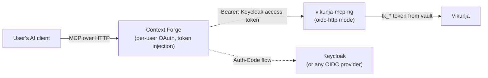

# Deploying behind IBM MCP Context Forge (OIDC resource-server mode)

This is a deployment guide for running `vikunja-mcp-ng` as a hosted,
multi-user MCP server behind [IBM MCP Context
Forge](https://github.com/IBM/mcp-context-forge) (the "gateway"), with
Context Forge performing per-user OAuth against an OIDC provider — Keycloak
is used as the worked example throughout, with placeholder URLs/IDs you
replace with your own realm; nothing Keycloak-specific lands in this
project's code, per `docs/OIDC-RESOURCE-SERVER.md`'s design (any standards-
compliant OIDC provider works identically from this server's point of view).

**Status note:** this doc describes the deployment shape against Context
Forge's documented gateway-registration model (`auth_type: oauth`,
authorization-code flow, per-user token injection). It has not been verified
against a live Context Forge + Keycloak pair in this repository's own test
stack (`docker/e2e/` only runs Vikunja itself, not a gateway or IdP) — treat
the Context-Forge-side instructions as "this is the documented, intended
integration path," and this project's own side (transport/OIDC
config, provisioning tool, threat-model tests) as the part that is verified
here, in `tests/oidc/` and `scripts/oidc-e2e.ts`. If you hit a discrepancy
against your Context Forge version, please file it — this doc should track
reality.

If you haven't already, read
[`docs/OIDC-RESOURCE-SERVER.md`](OIDC-RESOURCE-SERVER.md) first — it's the
design this guide implements. The one sentence that matters most: **a
Keycloak/OIDC access token authenticates a person, it is not a Vikunja
credential** — this server still needs each user to link their own Vikunja
`tk_*` API token once, via the `provision` walkthrough below.

## Architecture recap



- **Context Forge** owns the human-facing login (Authorization Code flow
  against Keycloak), holds/refreshes the resulting Keycloak access token per
  user, and injects it as `Authorization: Bearer <token>` on every MCP
  request it proxies to this server.
- **This server** validates that bearer token (signature, issuer, audience,
  expiry — never talks to Keycloak's token endpoint itself) and looks up a
  Vikunja `tk_*` credential for the validated `(issuer, sub)` in its own
  credential vault.
- **Vikunja** only ever sees this server's own REST calls carrying a real
  `tk_*` token — it has no idea Context Forge or Keycloak exist.

## Prerequisites

- `vikunja-mcp-ng` reachable by Context Forge over HTTP (same host/pod is the
  supported topology today — see "Host binding" below), running in
  `oidc-http` transport mode.
- A Keycloak realm (or other OIDC provider) with a confidential client
  configured for Context Forge's own Authorization Code flow. **This
  server never talks to Keycloak** — it only needs the realm's issuer URL
  and JWKS endpoint (both from Keycloak's `.../.well-known/openid-configuration`
  discovery document) to validate tokens Context Forge already obtained.
- A running Vikunja instance reachable from this server (`VIKUNJA_URL`) —
  the same "one shared Vikunja instance for everyone" model this server
  always uses; there is no per-user Vikunja instance routing.
- A 32-byte master key for the credential vault (`openssl rand -hex 32`).

## This server's configuration

Set these on the `vikunja-mcp-ng` process (env vars; see
[`docs/CONFIGURATION.md`](CONFIGURATION.md) for the general config-loading
rules — env always wins over the config file):

| Purpose | Env var | Example / notes |
|---|---|---|
| Transport mode | `VIKUNJA_MCP_TRANSPORT` | `http` (default is `stdio` — must be changed) |
| Bind host | `VIKUNJA_MCP_HTTP_HOST` | `127.0.0.1` if Context Forge is co-located (default, recommended); `0.0.0.0` only with `allowedHosts` + network policy for a cross-host gateway |
| Bind port | `VIKUNJA_MCP_HTTP_PORT` | `8765` (default) |
| Request path | `VIKUNJA_MCP_HTTP_PATH` | `/mcp` (default) — this is the path you register as the gateway's upstream URL |
| Trusted issuer | `VIKUNJA_MCP_OIDC_ISSUER` | Your realm's issuer, e.g. `https://keycloak.example.com/realms/your-realm` — must match the token's `iss` claim **exactly** (string compare, no prefix matching) |
| Expected audience | `VIKUNJA_MCP_OIDC_AUDIENCE` | The client-id (or custom audience/scope) Context Forge's own Keycloak client is issued tokens for — comma-separated if more than one is valid |
| JWKS endpoint | `VIKUNJA_MCP_OIDC_JWKS_URI` | e.g. `https://keycloak.example.com/realms/your-realm/protocol/openid-connect/certs` |
| Allowed algorithms | `VIKUNJA_MCP_OIDC_ALLOWED_ALGS` | Leave unset (defaults to `RS256`) unless your IdP uses something else — `none` and unexpected `HS*` are never accepted regardless |
| Clock skew tolerance | `VIKUNJA_MCP_OIDC_CLOCK_SKEW_SEC` | Leave unset (defaults to 60s) unless you have a specific reason |
| Required scope (optional) | `VIKUNJA_MCP_OIDC_REQUIRED_SCOPE` | Only if you want a coarse scope gate beyond "token is valid for this audience" |
| Shared Vikunja instance | `VIKUNJA_URL` | e.g. `https://vikunja.example.com/api/v1` |
| Vault file path | `VIKUNJA_MCP_VAULT_PATH` | e.g. `/data/vikunja-mcp/vault.json` — on a persistent volume; `0600` permissions, atomic writes |
| Vault master key | `VIKUNJA_MCP_VAULT_KEY` (or `_FILE`) | 32 bytes: `openssl rand -hex 32` (64 hex chars) or `openssl rand -base64 32`. Prefer the `_FILE` variant (points at a Docker/Kubernetes secret file) so the key never appears in `docker inspect` / process listings — see `docs/CONFIGURATION.md`'s Secrets Management section for the general `_FILE` convention this reuses. |

**Do not set** `VIKUNJA_API_TOKEN` / `VIKUNJA_API_TOKEN_FILE` on an
`oidc-http` deployment — those are the single-tenant `stdio`-mode
auto-connect variables and have no per-user meaning here; every user's
credential comes from the vault instead, via `provision` below.

## Registering this server in Context Forge

Context Forge registers upstream MCP servers as "gateways" (via its Admin UI
or the `POST /gateways` registration API — consult your Context Forge
version's docs for the exact form). The fields that matter for this server:

| Context Forge field | Value |
|---|---|
| Gateway / upstream URL | `https://<this-server-host>:<port><path>`, e.g. `https://vikunja-mcp.internal:8765/mcp` |
| Transport | Streamable HTTP |
| `auth_type` | `oauth` (authorization_code) — Context Forge performs the user-facing login; **not** `basic` or `bearer` (those model a single shared credential, which is exactly what this server's per-user vault replaces) |
| OAuth provider / issuer | Your Keycloak realm's issuer URL (the same value as this server's `VIKUNJA_MCP_OIDC_ISSUER`) |
| OAuth client id / secret | Context Forge's own confidential client registered in Keycloak — **not** anything this server needs to know |
| Redirect URI | Context Forge's own callback URL, registered on the Keycloak client — again, not something this server is involved in |
| Scopes requested | Whatever your Keycloak client is configured to request; must result in tokens whose audience matches this server's `VIKUNJA_MCP_OIDC_AUDIENCE` |
| Health check path | `/healthz` (unauthenticated liveness — never touches the vault or Vikunja) |

Once registered, Context Forge handles the Authorization Code dance with
Keycloak per user and forwards `Authorization: Bearer <access-token>` on
every proxied MCP call — this server never sees a Keycloak login form, a
client secret, or a refresh token; it only ever validates the bearer it's
handed (`docs/OIDC-RESOURCE-SERVER.md` §3b).

## Provisioning walkthrough (end users)

The gateway login proves *who you are*; it does not give this server
anything to call Vikunja with. Each user links their own Vikunja API token
**once**, through the MCP tool surface itself — no separate web form:

1. **Sign in** through your organization's normal Context-Forge-fronted MCP
   client flow (however your client surfaces "Connect" / "Sign in with
   Keycloak" — this is entirely Context Forge's UI, not this server's).
2. **Create a Vikunja API token**, if you don't already have one: in
   Vikunja's web UI, go to **Settings → API Tokens**, create a token, and
   copy it (`tk_...`).
3. **Provision it** by calling the `vikunja_auth` tool with the `provision`
   subcommand and that token, e.g. (however your MCP client exposes tool
   calls — this is the same `vikunja_auth` tool `stdio` mode already has,
   with two new subcommands):
   ```json
   { "subcommand": "provision", "apiToken": "tk_xxxxxxxxxxxxxxxxxxxx" }
   ```
   The server verifies the token actually works against Vikunja (a `GET
   /info` + a cheap authenticated call) *before* storing it, encrypts it
   (AES-256-GCM) into the vault keyed to your validated identity, and
   confirms with a masked response — it never echoes your token back.
4. **Use any tool normally** — `vikunja_tasks`, `vikunja_projects`, etc. —
   your Vikunja calls now run with your own linked token.
5. **Check your link status any time** with `{ "subcommand": "status" }` —
   reports whether you're linked, a masked token prefix, and when you
   provisioned. It only ever reports **your own** status, never another
   user's.
6. **Unlink** with `{ "subcommand": "deprovision" }` (alias: token rotation
   — deprovision the old one, then provision the new one). Idempotent: doing
   it twice is not an error.

Nothing above is Keycloak-specific — the same three subcommands
(`provision` / `status` / `deprovision`) work identically against any OIDC
provider, because this server never talks to the provider directly; it only
validates whatever bearer Context Forge hands it.

## Troubleshooting

A quick decision guide for "a tool call isn't working," since three
different failure layers can all look superficially similar:

### `401 invalid_token` (HTTP-level, before any tool runs)

The **bearer token itself** was rejected — this server's JWT validation
middleware (`docs/OIDC-RESOURCE-SERVER.md` §3b), not a Vikunja or vault
problem. Causes (all logged server-side at `warn`, with the specific reason
**never** returned to the client — see `tests/oidc/threat-model.test.ts` for
the exact defended cases):

- Missing/malformed `Authorization` header.
- Expired token, or the gateway's session with Keycloak lapsed and it sent a
  stale token.
- Wrong audience — the token was minted for a different client than
  `VIKUNJA_MCP_OIDC_AUDIENCE` expects (check Context Forge's configured
  scopes/client against this server's `VIKUNJA_MCP_OIDC_AUDIENCE`).
- Wrong issuer, or `VIKUNJA_MCP_OIDC_JWKS_URI`/`VIKUNJA_MCP_OIDC_ISSUER`
  point at the wrong realm.
- Unsigned (`alg: none`) or unexpectedly-algorithm'd token — always rejected
  regardless of configuration; this is not something to "fix" by relaxing
  `VIKUNJA_MCP_OIDC_ALLOWED_ALGS`.

**Fix:** verify `VIKUNJA_MCP_OIDC_ISSUER`/`_AUDIENCE`/`_JWKS_URI` exactly
match your Keycloak realm/client, and that Context Forge's registered
gateway is actually sending a live, unexpired token. A `401` at this layer
never reaches this server's tool code at all — the request is rejected
before `tools/call` is even dispatched.

### `AUTH_REQUIRED` — "haven't linked a Vikunja API token yet" (tool-level)

The **bearer token was valid** (HTTP succeeded, `200`) — this is a
structured tool-result error, not an HTTP failure. It means: this identity
authenticated successfully, but has no vault record. This is expected and
routine for a first-time user, or one who deprovisioned. **Fix:** run
`vikunja_auth provision` (see the walkthrough above). If a user insists
they already provisioned:

- Confirm they're signing in as the **same** Keycloak identity each time
  (`sub` is the tenancy key — a user with two different SSO accounts /
  realms has two independent vault records).
- Confirm the vault file (`VIKUNJA_MCP_VAULT_PATH`) is on a **persistent**
  volume that survives container restarts — an ephemeral filesystem means
  every restart wipes every user's provisioning.
- Check `GET /readyz` — it reports not-ready if the vault file failed to
  load (e.g. corrupted), which would explain mass "unprovisioned" reports
  across many users simultaneously (a single-file failure, not a per-user
  issue).

### Circuit breaker open (`opossum` breaker tripped)

Surfaces as a tool error mentioning the breaker/circuit state rather than a
normal Vikunja error message. This server's circuit breakers
(`src/utils/retry.ts`) are **shared across all users, per Vikunja endpoint
path** (decision D3, `docs/OIDC-RESOURCE-SERVER.md` §3c) — they protect the
one shared Vikunja instance, not any individual user. This means:

- **One user's traffic against a broken/slow Vikunja endpoint can trip the
  breaker for every user** — this is a deliberate, accepted cross-user
  coupling (not a bug to report per-incident), documented in the design's
  threat model as a residual risk, mitigated by per-user rate limiting (D8)
  but not eliminated.
- **Fix:** this is a Vikunja-health problem, not an OIDC/gateway/vault
  problem — check the shared Vikunja instance itself. The breaker will
  reset automatically once Vikunja recovers (or the reset timeout elapses).
- Don't confuse this with `401`/`AUTH_REQUIRED` above: a breaker-open error
  happens **after** both the bearer-token check and the vault lookup
  succeeded — the request got all the way to "the shared Vikunja instance is
  unhealthy," which is a different remediation path entirely.

### Everything passed auth, but the tool call still fails / uses the wrong data

If a tool call gets past the token check and the `AUTH_REQUIRED` prompt
(i.e., you're authenticated, you've provisioned, and you still don't get
correct per-user behavior) — check this project's own current known gap: as
of the H2b wave item, most tool handlers still resolve their Vikunja
credential from a process-global reference rather than the per-identity one
`getAuthManagerFromContext()` resolves (see
`docs/LOCAL-TESTING.md`'s "OIDC `oidc-http` transport e2e lane" section and
the inline comment in `scripts/oidc-e2e.ts` step (d) for the full
write-up). Until that's fixed, treat `oidc-http` mode as **validated at the
authentication/authorization boundary** (threat model, provisioning, vault)
but **not yet safe for real multi-user tool traffic** in production.

## Security notes

- **The gateway is the trust anchor.** If Context Forge is compromised, an
  attacker can mint/inject valid-looking bearer tokens for arbitrary users
  and this server will honor them — this is by design (Context Forge *is*
  what authenticates users), not a gap in this server.
- **This server adds no authorization layer above Vikunja's own.** A
  provisioned user can do in Vikunja exactly what their own `tk_*` token
  permits — nothing more, nothing less.
- **Losing both the vault file and its master key together** is equivalent
  to losing every user's Vikunja token in plaintext. Keep the master key in
  a secret manager / separate volume from the vault file itself; see
  `docs/OIDC-RESOURCE-SERVER.md` §4's threat model for the full accounting
  of what is and isn't defended.

## See also

- [`docs/OIDC-RESOURCE-SERVER.md`](OIDC-RESOURCE-SERVER.md) — the full design this guide implements.
- [`docs/CONFIGURATION.md`](CONFIGURATION.md) — general config-loading rules, the `_FILE` secrets convention, module gating.
- [`docs/LOCAL-TESTING.md`](LOCAL-TESTING.md) — the local e2e stack, including the `oidc-http` e2e lane (`npm run test:e2e:oidc`) that exercises the flow this guide describes end to end against a mock issuer.
