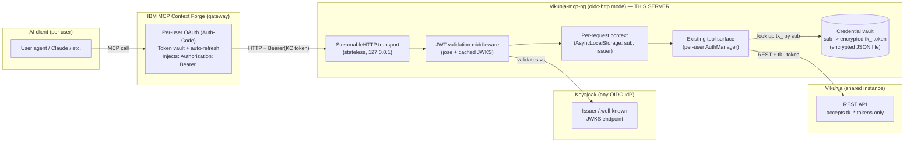

# Design: OIDC resource-server mode (behind IBM MCP Context Forge + Keycloak)

**Status:** DECIDED — design locked 2026-07-20 (owner review complete). Not implemented yet; this document is the spec the wave workers build against. Target release **0.6.0**.
**Author:** coordinator (design pass, 2026-07-19); decisions locked by the owner, 2026-07-20.
**Companion docs:** [docs/ROADMAP.md](../ROADMAP.md) (decision-log tone this doc follows; see its §3 for the append-only entry recording this epic's approval), [docs/CONFIGURATION.md](../CONFIGURATION.md), [docs/ARCHITECTURE.md](../ARCHITECTURE.md).

This document proposes making `vikunja-mcp-ng` deployable as a **multi-user HTTP MCP server** sitting behind IBM MCP Context Forge, where Context Forge runs per-user OAuth against Keycloak and injects a per-user OIDC access token on every request. It is written to be **generic across OIDC providers** — Keycloak is the reference deployment, nothing org-specific lands in code.

> Grounding note: every "today" claim below was checked against `main` at draft time (SDK `@modelcontextprotocol/sdk@1.22.0`, `jose@6.2.3` present transitively). `better-sqlite3` was declared but unused in `src/` at draft time; it is removed from `package.json` entirely as part of locking this design (Decision log, D2) — the credential vault below is an encrypted JSON file, not SQLite.

---

## Decision log (locked 2026-07-20)

All open questions this design raised were resolved by the owner on 2026-07-20. Recorded here append-only, decision-log style (decision + reason + revisit condition), matching `docs/ROADMAP.md` §3's tone. Wave workers should treat every row as settled — no "recommendation" language remains for these points anywhere else in this document.

| # | Decision | Reason | Revisit condition |
|---|---|---|---|
| D1 | Credential vault = **encrypted JSON file** (AES-256-GCM via Node's built-in `crypto`, per-record IV, master key via the existing `_FILE` secrets machinery, atomic write-then-rename) — **not** `better-sqlite3`. | Honors the standing parked-SQLite decision (`docs/ROADMAP.md` §3a(b)): a per-`(issuer,sub)` key→token vault is not the "real relational or query need" that decision's reopening trigger requires. Matches the existing `src/storage/templateFileStore.ts` file-store pattern already in the codebase (opt-in JSON, write-temp-then-rename, `0600`-style discipline), so the vault reuses a proven shape instead of introducing a second persistence paradigm. | If the vault ever needs queries/joins across records, or scale beyond a single file is required. |
| D2 | `better-sqlite3` is **dropped from `package.json` entirely** (dependency and `@types/` package). | Zero usage anywhere in `src/`, `tests/`, or `scripts/` — grep-zero proven (see the PR that lands this doc). It was a dangling native dependency never wired to a code path; D1 removes the only reason it was ever considered. | None — this is a closure, not an open question. If a future need genuinely requires SQLite, that is a new decision made on its own merits, not a reversal of this one. |
| D3 | Circuit breakers **stay shared** across users (the existing per-endpoint-path `circuitBreakerRegistry`, `src/utils/retry.ts`, is not re-keyed per-`sub`). | They protect the *one shared upstream Vikunja instance*, not a per-user resource. Per-user rate limits (D8) already handle noisy-neighbor fairness independently of breaker state. This is an accepted, honestly-documented cross-user coupling (§4), not an oversight. | If multi-Vikunja-instance support lands (i.e., different users' requests can route to *different* upstream Vikunja instances), per-instance or per-sub breaker isolation becomes necessary and this should be revisited. |
| D4 | Vault crypto = **AES-256-GCM via Node's built-in `crypto`**, one operator-supplied 32-byte master key (`VIKUNJA_MCP_VAULT_KEY[_FILE]`), random 12-byte IV per record, authenticated (GCM tag verified on decrypt). | Authenticated encryption from the stdlib — no `libsodium`/`age` dependency to add. The master key rides the existing `_FILE` secrets convention unchanged (one line in `SENSITIVE_ENV_VARS`, `src/config/secrets.ts`). | If per-user envelope keys or an external KMS/HSM are required. |
| D5 | Transport = **stateless** `StreamableHTTPServerTransport` (`sessionIdGenerator: undefined`). | The tenancy key is the OIDC `sub`, not an MCP session id. Context Forge already owns session/user lifecycle; a second, MCP-level session keyspace to keep aligned with `sub` (plus a per-session in-memory store) would be one more thing to leak across users for no benefit today. | If a future feature needs server-initiated push (SSE resumability, server notifications) — reintroduce stateful mode with the session id **bound to `sub`** and re-run the isolation matrix (§3d) against it. |
| D6 | Request context = **`AsyncLocalStorage`** (`RequestContext { issuer, sub, authManager }`), re-pointing the existing `getAuthManagerFromContext()` (`src/client.ts`) to ALS-first with the current global singleton as `stdio`-mode fallback. | Dozens of REST-migrated call sites already recover credentials through this one accessor. Re-pointing it isolates users with minimal churn instead of threading an `authManager` parameter through every call stack in the tool surface. | If ALS context loss across some async boundary is observed in practice — thread explicitly for that specific path rather than abandoning ALS wholesale. |
| D7 | Self-service provisioning via new `vikunja_auth` subcommands (`provision` / `status` / `deprovision`), with `sub` (and `issuer`) read **always** from the validated request token (ALS), **never** from a tool argument. | Consistent with the standing "no login ceremonies over MCP" constraint (`docs/ROADMAP.md` §4's "Never" verdict on interactive login/OIDC-callback) — the user still only ever pastes a Vikunja `tk_` token they created themselves; nothing new is asked of Vikunja. Reading identity only from the validated token closes the "claim to be someone else" spoofing vector by construction. | If Vikunja grows federated/OIDC-issued API tokens, provisioning could become fully automatic and this manual step could be dropped. |
| D8 | Rate limiting = **per-`sub` buckets, plus an optional global ceiling**. | Per-sub buckets give fairness (one user can no longer starve others via the current per-process bucket). The optional global ceiling protects the one shared Vikunja instance from aggregate load across all users combined. | Tune the default ceiling value against real deployment load once H2 ships; not expected to need a design revisit, only a config default change. |
| D9 | e2e identity provider = **mock OIDC issuer as the CI default** (self-signed JWKS + `jose`'s `SignJWT` minting helper), with an **optional, manually-triggered real-Keycloak lane**. | CI needs deterministic, fast, offline token minting, including the exact malformed-token cases the threat model (§4) requires to test (wrong `aud`, `alg:none`, expired, unknown `kid`) — awkward and slow against a real IdP. The real-Keycloak lane still exists to catch discovery-doc/JWKS-rotation realities the mock can't. | If mock/real drift ever causes an escaped bug — i.e., something the mock validated that a real Keycloak token would have failed, or vice versa. |
| D10 | **`jose` promoted to a direct, pinned dependency** (currently transitive via the SDK, at `6.2.3`). | A security-critical validation path (JWT signature/issuer/audience/expiry checking) should not ride on a version pinned only by a transitive resolution that could shift under an unrelated SDK bump. | None expected; revisit only if `jose` itself is deprecated/replaced. |
| D11 | **Single-issuer first**: `oidc.issuer` ships as a scalar config value; internal keying is still `(issuer, sub)` pairs so multi-issuer support is additive later. | Multi-issuer allowlisting is real but not needed for the initial Context-Forge-plus-Keycloak deployment; keying on the pair from day one means adding a second issuer later is a config/allowlist change, not a data-model migration. | When a second IdP/realm needs to be supported concurrently. |

No open decisions remain from the design draft — every "recommendation" the draft raised is now one of the eleven rows above. Sections below are written to read as decided throughout; where the original draft argued a case *for* an option that was not chosen (notably SQLite for the vault), that argument has been rewritten rather than left in place.

---

## 1. Motivation & topology

### 1.1 Why

Today the server is **single-tenant and stdio-only**. `src/index.ts` opens one `StdioServerTransport`, constructs exactly one `AuthManager`, and stores one `AuthSession { apiUrl, apiToken, authType }` for the whole process. Every tool recovers that one credential through the process-global `ClientContext` singleton (`src/client.ts`, `getAuthManagerFromContext()`). That is correct for "one human runs one MCP client on their laptop with their own `tk_` token" and must stay the default.

It does **not** work for a hosted deployment where many users share one server process and each must act as *themselves* in Vikunja. The target deployment is:

- **IBM MCP Context Forge** (the "gateway") is the single ingress. It performs per-user Authorization-Code flows against **Keycloak** using its own confidential client, vaults the resulting per-`(gateway, user)` tokens, refreshes them automatically, and injects `Authorization: Bearer <keycloak-access-token>` on every MCP request it proxies to us.
- We are a pure **OIDC resource server**: we *validate* the bearer token (signature, issuer, audience, expiry) and derive a stable user identity (`sub`) from it. We never run a login flow, never hold a refresh token, never talk to Keycloak's token endpoint.

### 1.2 The critical gap this design exists to close

**A Keycloak access token authenticates a person; it is not a Vikunja credential.** Vikunja only accepts its own `tk_*` API tokens (or its own short-lived JWTs from *its* login). There is no upstream token exchange that turns a Keycloak token into a Vikunja token. So proving "you are `sub=abc`" tells us *who* is calling but gives us **nothing to call Vikunja with**.

The server therefore needs an **identity → credential vault**: a per-user Vikunja `tk_` token, keyed by OIDC `sub`, encrypted at rest, provisioned once by the user through their authenticated session, masked everywhere. This vault is the heart of the epic; §3(c) specifies it — as a locked decision (D1), an encrypted JSON file, not a database.

### 1.3 Deployment topology

Trust boundary: **the gateway is trusted** (it authenticates users and mints the tokens we consume). Everything left of `T` is out of our threat model except insofar as we validate what arrives (§4).

---

## 2. Modes

We introduce a single top-level **transport mode** switch. The current behaviour is Mode A and is **unchanged and default**.

| | **Mode A — `stdio` (default, unchanged)** | **Mode B — `oidc-http` (new, opt-in)** |
|---|---|---|
| Transport | `StdioServerTransport` | `StreamableHTTPServerTransport` (stateless — D5) |
| Tenancy | Single-user (one process = one person) | Multi-user (one process = many people) |
| Identity | The `tk_`/JWT in `VIKUNJA_API_TOKEN` / `vikunja_auth connect` | OIDC `sub` from a validated bearer per request |
| Vikunja credential | The one static token | Per-user `tk_` from the vault (§3c) |
| Who runs it | npm/local/Docker-desktop users | Behind Context Forge |

**Selection rule:** `oidc-http` mode activates only when **all** of `transport=http`, `oidc.issuer`, `oidc.audience`, and a vault key are present. Any missing → hard startup error (fail loud, never silently downgrade a hosted deployment to no-auth). `transport=stdio` (or unset) → today's path, no OIDC code loaded, no HTTP listener.

### 2.1 Proposed config keys

The existing config engine (`src/config/ConfigurationManager.ts`) already does layered `defaults → vikunja-mcp.config.json → env (wins)` with Zod validation, plus the `_FILE` Docker-secrets convention (`src/config/secrets.ts`, `SENSITIVE_ENV_VARS`). We extend it, not replace it. New sections `http` and `oidc`, plus a `vault` section; `transport` is top-level (like `readOnly`).

| Concern | Env var | Config-file key | Notes |
|---|---|---|---|
| Transport | `VIKUNJA_MCP_TRANSPORT` | `transport` | `stdio` (default) \| `http` |
| Bind host | `VIKUNJA_MCP_HTTP_HOST` | `http.host` | default `127.0.0.1` (see §3a) |
| Port | `VIKUNJA_MCP_HTTP_PORT` | `http.port` | default `8765` |
| Allowed Host headers | `VIKUNJA_MCP_HTTP_ALLOWED_HOSTS` | `http.allowedHosts` | comma list → SDK `allowedHosts` |
| Path | `VIKUNJA_MCP_HTTP_PATH` | `http.path` | default `/mcp` |
| OIDC issuer | `VIKUNJA_MCP_OIDC_ISSUER` | `oidc.issuer` | e.g. `https://iam.example.org/realms/foo` — **generic**; single-issuer scalar (D11) |
| OIDC audience | `VIKUNJA_MCP_OIDC_AUDIENCE` | `oidc.audience` | required `aud` value(s); comma list allowed |
| JWKS URI (override) | `VIKUNJA_MCP_OIDC_JWKS_URI` | `oidc.jwksUri` | optional; default discovered from issuer `/.well-known/openid-configuration` |
| Allowed algs | `VIKUNJA_MCP_OIDC_ALLOWED_ALGS` | `oidc.allowedAlgs` | default `RS256` (allowlist; see §3b) |
| Clock skew (s) | `VIKUNJA_MCP_OIDC_CLOCK_SKEW` | `oidc.clockSkewSec` | default `60` |
| Required scope (opt) | `VIKUNJA_MCP_OIDC_REQUIRED_SCOPE` | `oidc.requiredScope` | optional coarse gate |
| Vault file path | `VIKUNJA_MCP_VAULT_PATH` | `vault.path` | path to the encrypted JSON vault file (D1); path is **not** secret, the key is |
| **Vault master key** | `VIKUNJA_MCP_VAULT_KEY` **/ `VIKUNJA_MCP_VAULT_KEY_FILE`** | *(never in file)* | **add to `SENSITIVE_ENV_VARS`**; 32-byte key, base64 (D4) |
| Shared Vikunja URL | `VIKUNJA_URL` (existing) | `auth.vikunjaUrl` | one shared Vikunja base URL for all users |

**Interaction with existing config:**
- Module gating (`ModulesConfigSchema`, `DANGEROUS_MODULE_KEYS`) is **unchanged** and still applies — it gates *tool registration*, which is process-wide, in both modes. `oidc-http` layers per-user *credential* isolation *underneath* the same module gates. Config can still only narrow, never widen.
- `readOnly` still works and still short-circuits writes for everyone.
- `VIKUNJA_API_TOKEN` is **ignored** in `oidc-http` mode (there is no single static token); setting it alongside `transport=http` should be a startup warning, not an error (harmless leftovers in shared env files).
- The vault key is the only genuinely new secret and rides the existing `_FILE` machinery for free by adding it to `SENSITIVE_ENV_VARS` — a one-line change in `src/config/secrets.ts`. Both-set (`VIKUNJA_MCP_VAULT_KEY` + `_FILE`) is already a hard error via `readSecretEnv`.

---

## 3. Component design

Four work areas: (a) transport, (b) JWT middleware, (c) vault, (d) per-user isolation. (d) is the risky one and gets the most ink.

### 3(a). Streamable HTTP transport

**SDK specifics (verified, `@modelcontextprotocol/sdk@1.22.0`):** `StreamableHTTPServerTransport` (from `@modelcontextprotocol/sdk/server/streamableHttp.js`) supports **stateful** (`sessionIdGenerator: () => randomUUID()`) and **stateless** (`sessionIdGenerator: undefined`) modes. Its `handleRequest(req, res, parsedBody?)` accepts a Node `IncomingMessage & { auth?: AuthInfo }` — i.e. the transport is explicitly designed for an auth middleware to attach an `auth` object to the request before it reaches the transport. It also exposes `allowedHosts` and `enableDnsRebindingProtection` options. The transport already depends on `@hono/node-server` (present in `node_modules`), so no new HTTP framework is required — a thin `node:http` listener that calls `transport.handleRequest` is enough.

**Transport statefulness (D5): stateless (`sessionIdGenerator: undefined`).** Context Forge already owns session/user lifecycle; adding an MCP-session layer on top would create a *second* identity keyspace to keep aligned with `sub` (and a per-session in-memory store that is one more thing to leak across users). Stateless means every request is authenticated and isolated purely from its bearer token — simplest correct thing. See D5's revisit condition for when to reconsider (server-push features).

**Session semantics.** "Session" today means the single global `AuthManager`. In `oidc-http` mode we redefine the effective session as **per-request, derived from the validated token**, carried in `AsyncLocalStorage` (§3d, D6). There is deliberately no long-lived per-connection session object; connection == one authenticated JSON-RPC call's worth of context.

**Host binding / DNS-rebinding stance.**
**Decision — bind `127.0.0.1` by default and enable DNS-rebinding protection (`enableDnsRebindingProtection: true` with `allowedHosts` from config) because the gateway is expected co-located (same host/pod) — revisit for cross-host gateway deployments, which must set `http.host=0.0.0.0` + explicit `allowedHosts` + network policy.** Binding loopback by default means a misconfigured deployment fails closed (unreachable) rather than exposing an unauthenticated-looking port to the LAN. DNS-rebinding protection defends a browser-based attacker from using a victim's browser to reach a loopback server; cheap to enable, matches the SDK's own security guidance.

**Health/readiness.** Add an unauthenticated `GET /healthz` (liveness) that never touches the vault or Vikunja, and a `GET /readyz` that checks JWKS reachability + vault file openable. These sit *outside* the MCP path and the JWT middleware.

### 3(b). JWT validation middleware

A small middleware runs before `transport.handleRequest`, validates the bearer, and attaches `{ sub, issuer, claims }` for the request context.

**Dependency (D10) — `jose` is a direct, pinned dependency.** It is already in the tree at `6.2.3` (transitive via the SDK). `jose` gives us `createRemoteJWKSet` (JWKS fetch + cache + `kid` rotation) and `jwtVerify` (issuer/audience/expiry/alg allowlist/clock-tolerance in one call). No hand-rolled crypto.

**Validation contract (all failures → `401` with `WWW-Authenticate: Bearer error="invalid_token"`, generic body, details only to logs):**
- **Signature** verified against JWKS from `createRemoteJWKSet(new URL(jwksUri))`. JWKS cached in-process with `jose`'s built-in caching + cooldown; `kid` rotation handled automatically.
- **`alg` allowlist** — reject anything not in `oidc.allowedAlgs` (default `['RS256']`). Explicitly reject `none` and, unless configured, HMAC algs (`HS*`) — an HMAC-accepting verifier against a public JWKS is an alg-confusion foot-gun.
- **`iss`** must equal `oidc.issuer` exactly (string compare, no prefix match).
- **`aud`** must contain `oidc.audience`. **Strict** — a token minted for another client/audience in the same realm must be rejected (audience-confusion defence, §4).
- **`exp` / `nbf` / `iat`** validated with `clockTolerance: oidc.clockSkewSec` (default 60s).
- Optional **`requiredScope`** — if configured, the token's `scope`/`scp` must include it.
- **`sub`** must be present and non-empty — it is our tenancy key; a token without a stable `sub` is rejected.

**Identity derived = `(issuer, sub)`.** We key everything on the pair, not `sub` alone, so that two IdPs (or two realms) that happen to mint the same `sub` never collide. Single-issuer ships first (D11: `oidc.issuer` is a scalar), but the pair-keying means multi-issuer support is additive later — no data-model change, just an allowlist.

**Failure responses.** `401` for missing/invalid/expired token; `403` only for a validly-authenticated user who lacks `requiredScope`. Never leak *why* validation failed to the client (could aid token forgery probing); the specific reason (bad `kid`, `aud` mismatch, expired) goes to logs at `warn`, with the token itself **never logged** — reuse `maskCredential`/`sanitizeLogData` from `src/utils/security.ts`.

We deliberately do **not** use the SDK's `bearerAuth`/`OAuthServerProvider` machinery (`server/auth/*`): those model *us* as the OAuth authorization server (issuing/introspecting tokens, dynamic client registration). Here Keycloak is the AS and we are a plain resource server doing offline JWT validation — a focused `jose` middleware is a better fit and far less surface.

### 3(c). Credential vault

The vault maps `(issuer, sub) → encrypted Vikunja tk_ token`.

**Store (D1) — encrypted JSON file, not SQLite.** `better-sqlite3` is removed from `package.json` entirely as part of locking this design (D2) — it was a dangling, unused dependency, and the credential vault is a single-key-value-per-user store, not a relational workload. This honors the standing parked-SQLite decision in `docs/ROADMAP.md` §3a(b): that decision's reopening trigger is "a real relational or query need — e.g., a local task cache with filtering/joins, or genuine offline support requiring more than 'read the last-known JSON blob.' Simple durability alone does not meet this bar." A `(issuer,sub) → token` vault is exactly "read the last-known blob" — it does not meet the bar. The vault instead reuses the pattern already proven in this codebase for `vikunja_templates` persistence (`src/storage/templateFileStore.ts`): an opt-in, single JSON file, loaded on first use and rewritten atomically on every mutation.

**File shape.** One JSON file at `vault.path`, permissions `0600`, on a persistent volume. Top-level shape: an object keyed by `"<issuer>|"` (a single string key, so the file stays a plain JSON object rather than needing a nested two-level structure):

| Field | Type | Note |
|---|---|---|
| `vikunjaUrl` | string | the shared `VIKUNJA_URL` at provision time (sanity/audit) |
| `ciphertext` | string (base64) | AES-256-GCM ciphertext of the `tk_` token |
| `iv` | string (base64) | 12-byte random nonce, unique per write |
| `authTag` | string (base64) | GCM authentication tag |
| `keyVersion` | number | supports key rotation |
| `createdAt` / `updatedAt` / `lastUsedAt` | string (ISO-8601) or `null` | provisioning + usage audit |

**Atomicity — write-temp-then-rename, mirroring `templateFileStore.ts`'s `writeTemplatesFileAtomic`.** The vault's write path (a new `src/storage/vaultFileStore.ts`) creates the parent directory if missing, serializes the *entire* current record map, writes it to a temp file in the same directory (`.${basename}.${pid}.${timestamp}.tmp`), then `fs.renameSync`s it over the target path. Rename is atomic on the same filesystem (POSIX and Windows both guarantee this), so a reader never observes a partially-written vault file, and a crash mid-write leaves the previous good file intact. Reads tolerate a missing file (fresh deployment → empty vault, not an error) and log-and-empty on malformed JSON, matching the templates loader's defensive posture — except unlike templates, a malformed vault is also surfaced at `/readyz` as not-ready, since silently treating a corrupt credential store as "everyone must re-provision" deserves operator visibility.

**Encryption (D4) — AES-256-GCM using Node's built-in `crypto` (no new dependency).** A single operator-supplied 32-byte master key (`VIKUNJA_MCP_VAULT_KEY[_FILE]`), random 12-byte IV per record, authenticated (GCM tag). `keyVersion` is stored per record so a future key rotation can decrypt-old/encrypt-new lazily on `lastUsedAt`. The master key is **never** written to the config file (enforced by `_FILE` machinery) and **never** logged. A wrong key or tampered record fails GCM tag verification loudly (decrypt throws) rather than silently returning garbage.

**Provisioning flow — exact `vikunja_auth` tool-surface changes (D7).** `vikunja_auth` (`src/tools/auth.ts`) gains OIDC-mode subcommands. The enum today is `['connect','status','refresh','disconnect','info']`; in `oidc-http` mode we register a variant enum:

- **`provision`** (new) — args `{ apiToken: string }` (the user's own Vikunja `tk_` token, created by them in Vikunja's UI). The server:
  1. Reads `sub`/`issuer` from the request context (§3d) — **always**, **never** from an argument.
  2. Builds a throwaway `AuthManager` bound to `VIKUNJA_URL` + the supplied `tk_`, and runs the **existing** `verifyConnection()` logic (`GET /info` then `GET /projects?per_page=1`) to prove the token actually works before storing it. This reuses code already in `auth.ts`.
  3. On success, encrypts and upserts the `"<issuer>|"` record. Response is masked (`maskCredential`) and states "linked", never echoes the token.
  This is the **one-time-per-user** step. It replaces `connect` for this mode (you cannot "connect" a shared server to one URL/token).
- **`status`** — reports, for the calling `sub`: `linked: true/false`, masked token prefix, `provisionedAt`, `lastUsedAt`. Never reveals another user's status.
- **`deprovision`** (new, alias `unlink`) — deletes the calling `sub`'s vault record. Idempotent. This is the **deprovisioning** path; also the remedy when a user's Vikunja token is rotated/revoked (they `deprovision` then `provision` the new one).
- **`connect` / `disconnect`** — in `oidc-http` mode, `connect` returns a structured error pointing the user at `provision`; `disconnect` aliases `deprovision`. In `stdio` mode they behave exactly as today.
- **`info` / `refresh`** — unchanged semantics (`refresh` for `tk_` is still "not required"; §refresh scope note in §5).

**Missing-credential behaviour.** A validly-authenticated user who has **not** provisioned calls, say, `vikunja_tasks list`. There is no vaulted token, so the per-user `AuthManager` has no session. The tool's existing `createAuthRequiredError`/`AUTH_REQUIRED` path fires — but with an **oidc-mode-specific message**: *"You're authenticated as `<sub-masked>` but haven't linked a Vikunja API token yet. Run `vikunja_auth provision` with a token you create in Vikunja → Settings → API Tokens."* Structured `MCPError(AUTH_REQUIRED)`, **never a 500**, and it must not leak whether *other* users are provisioned.

### 3(d). Per-user session isolation — the risky area

Today essentially all session state is **process-global**, built on the assumption of one user. `oidc-http` mode must re-key each piece by `(issuer, sub)`. The mechanism that makes this tractable without rewriting every tool:

**Request-context mechanism (D6) — `AsyncLocalStorage`.** Carry per-request identity in `AsyncLocalStorage` (`RequestContext { issuer, sub, authManager }`), and make the existing `getAuthManagerFromContext()` return the ALS-scoped per-user `AuthManager` when one is present, falling back to today's global singleton in `stdio` mode. Dozens of REST-migrated call sites already recover credentials through `getAuthManagerFromContext()` (`src/client.ts`), so re-pointing that single accessor at an ALS store isolates users with minimal churn instead of threading an `authManager` param through every call stack. The JWT middleware, having validated the token, opens an ALS scope for the duration of `handleRequest`, constructs (or fetches from a small per-sub cache) an `AuthManager` seeded from the decrypted vault token, and runs the request inside it. Tool code is unchanged.

**Enumeration of every currently-global piece of state and its new keying:**

| # | Global state today | Where | New keying in `oidc-http` mode |
|---|---|---|---|
| 1 | Single `AuthManager` / `ClientContext.clientFactory` (one `AuthSession`) | `src/client.ts`, `src/index.ts` | **Per-`(issuer,sub)`** `AuthManager` via ALS `RequestContext`; global singleton retained only for `stdio` mode. **Primary leak risk.** |
| 2 | Rate-limiter bucket keyed `session_${process.pid}` | `src/middleware/simplified-rate-limit.ts` `getSessionId()` | **Per-`(issuer,sub)`** bucket, plus an optional global ceiling (D8). `getSessionId()` reads the ALS context; process-pid fallback only in `stdio`. (§4 fairness.) |
| 3 | Filter storage session id | `src/tools/filters.ts` → `storageManager.getStorage(sessionId,...)` | Session id = `(issuer,sub)` (via ALS), not the current credential-derived string. |
| 4 | Templates storage session id (`${apiUrl}:${apiToken.substring(0,8)}` or `anonymous`) | `src/tools/templates.ts` | Session id = `(issuer,sub)`. Persistence key becomes `${persistPath}:${issuer}:${sub}` (already `${persistPath}:${sessionId}` shaped). |
| 5 | `FilterStorageManager` instance map + 1h cleanup | `src/storage/SimpleFilterStorage.ts` | Unchanged mechanism; correctness follows automatically once the **key** is `(issuer,sub)` (#3/#4). Cleanup TTL now also bounds idle-user memory. |
| 6 | Circuit-breaker registry (per-endpoint-path, process-global) | `src/utils/retry.ts` `circuitBreakerRegistry`, `deriveRestBreakerName` | **Kept shared (D3)** — breakers track the *shared upstream Vikunja's* health, not a user. This is a deliberate, accepted cross-user coupling: one user's pathological requests can trip a breaker for all (§4). Per-sub rate limits (#2) are the mitigation for noisy neighbors; breaker isolation is out of scope unless D3's revisit condition (multi-Vikunja-instance support) fires. |
| 7 | `ConfigurationManager` singleton | `src/config/*` | Shared and correct — it is server config, identical for all users. No change. |
| 8 | `normalizedKeyCache` (masking) | `src/utils/security.ts` | Shared and safe — caches normalized *key names*, not secret values. No change. |
| 9 | The vault itself | new | Shared JSON file, **record-scoped by `"<issuer>|"` key** (§3c); every lookup MUST use the ALS `sub`, never an argument. |

**Cross-user-leak test matrix** (new test suite, `tests/oidc/isolation.test.ts` + battle scenarios):

| Test | Setup | Must observe |
|---|---|---|
| Credential isolation | User A provisions token Tᴬ; User B provisions Tᴮ; A lists tasks | A's REST calls carry Tᴬ only; Tᴮ never used for A |
| Missing-credential no-leak | A provisioned, B not; B calls a tool | B gets `AUTH_REQUIRED` provision prompt; response reveals nothing about A |
| Filter store isolation | A saves filter F; B lists filters | B sees none of A's filters |
| Templates store isolation | A creates template; B lists templates | B sees none of A's; persistence file rows keyed distinctly |
| Rate-limit isolation | A exhausts A's bucket | B's calls still succeed (independent bucket) |
| Vault lookup can't be spoofed | B sends a crafted arg claiming `sub=A` | Ignored; `sub` comes only from validated token |
| ALS context integrity | Concurrent interleaved A/B calls (Promise.all) | No request ever sees the other's `AuthManager` (property test) |
| Deprovision isolation | A deprovisions | B unaffected; A now gets provision prompt |
| Token swap | A deprovisions Tᴬ, provisions Tᴬ2 | subsequent A calls use Tᴬ2, never stale Tᴬ |
| Log masking under multi-user | Force errors for A and B | No raw token for either in logs; `sub` masked |

The **ALS context-integrity** test is the load-bearing one: it must run genuinely concurrent, interleaved requests and assert no bleed — the classic failure mode of an ALS/global-singleton hybrid.

---

## 4. Threat model

Framed as "what we defend, how" and "what we explicitly do not."

**Defended:**
- **Token theft / replay.** Tokens are short-lived (gateway auto-refreshes); we validate `exp` with bounded skew and never accept an expired token. We hold no long-lived bearer of our own. A stolen access token is usable only until expiry and only against the audience we require. TLS termination (gateway/ingress) prevents on-wire capture; loopback binding (§3a) keeps the raw port off the LAN.
- **Audience confusion.** Strict `aud` check (§3b) — a token minted for a *different* client in the same Keycloak realm is rejected. This is the primary defence against "any valid realm token can drive our tools."
- **Algorithm confusion.** `alg` allowlist (`RS256` default), `none` and unexpected `HS*` rejected — no verifying an attacker-supplied HMAC against public key material.
- **Issuer spoofing.** Exact `iss` match; JWKS fetched only from the configured issuer's discovery doc (or explicit `jwksUri`), over HTTPS.
- **Vault at rest.** AES-256-GCM, per-record IV, authenticated (D1/D4); master key only via env/`_FILE`, never in the config file, never logged; vault file `0600`. Compromise of the vault file alone (without the key) yields ciphertext only.
- **Log leakage.** All tokens (OIDC and `tk_`) pass through `maskCredential`/`sanitizeLogData` (`src/utils/security.ts`, already comprehensive). `sub` is masked in user-facing errors. Validation-failure *reasons* go to logs, not clients.
- **Spoofed identity via arguments.** `sub`/`issuer` are read **only** from the validated token via ALS, **never** from tool arguments — closes the "claim to be someone else" vector (matrix rows 6, 9).

**Multi-user rate-limit fairness (D8).** Per-`sub` buckets (state #2) stop one user starving others via the shared per-process bucket that exists today, plus an optional global ceiling protects the shared Vikunja from aggregate load. Note the residual: the **shared circuit breakers** (state #6, D3) are a genuine cross-user coupling — a user hammering a broken endpoint can open its breaker for everyone. This is accepted, not overlooked: breakers exist to protect the *shared* upstream, and D3's revisit condition (multi-Vikunja-instance support landing) is the trigger for reconsidering per-user breaker isolation, not a general fairness complaint.

**Explicitly NOT defended:**
- **Gateway compromise.** If Context Forge is compromised, the attacker can mint/inject valid-looking bearer tokens for arbitrary users and we will honour them — the gateway *is* our trust anchor. Out of scope by construction.
- **Vikunja-side authorization.** We act with the user's own `tk_`; whatever that token can do in Vikunja, the user can do. We add no authorization layer above Vikunja's own.
- **Master-key + vault file exfiltrated together.** If an attacker gets both the vault file and the master key, they get the plaintext `tk_` tokens. Mitigation is operational (separate key storage, `_FILE` mounts, secret managers), not cryptographic.
- **Malicious user provisioning a token they legitimately hold.** Not a threat — that is the feature.

---

## 5. Out of scope (and why)

- **Token refresh — the gateway's job.** Context Forge holds the Keycloak refresh token and re-mints access tokens; we only ever see fresh bearers. We add nothing. `vikunja_auth refresh` keeps its current honest "not required for `tk_`" semantics. (Consistent with ROADMAP §4's "Never" verdict on JWT `token/refresh`: architecturally unreachable for a static-token client.)
- **OIDC login ceremonies — still NEVER.** We do not implement `login`/`register`/OIDC callback/authorize. This holds the line already drawn in ROADMAP §4 (interactive login/register/OIDC-callback are "Never" over MCP). We are a resource server, not an authorization server. The user authenticates to Keycloak *through the gateway*, out of band from us.
- **Vikunja-side token exchange — not ours to build, but worth an upstream ask.** The whole vault exists because Vikunja won't accept an OIDC token. *Upstream feature-request sketch (one paragraph):* Vikunja already supports OIDC login (`auth.openid`); it could additionally (a) accept a validated OIDC **access token** as a bearer in *resource-server* mode — validating `iss`/`aud`/signature against a configured trusted IdP and mapping `sub`/`email` to a Vikunja user — or (b) expose an **RFC 8693 token-exchange** endpoint that trades a trusted-IdP OIDC token for a scoped `tk_`. Either would let this server drop the vault entirely and pass the OIDC token straight through (mode B collapses to "validate + forward"). This is decision-8-style upstream courtesy (ROADMAP §3, decision 8): draft after our work lands, don't block on it.

---

## 6. Migration & compatibility

- **npm / local / Docker-desktop users: zero impact.** `transport` defaults to `stdio`; none of the OIDC/vault/HTTP code paths load. `src/index.ts`'s existing stdio bootstrap is untouched; the HTTP bootstrap is a sibling branch selected only when `transport=http`.
- **Docker story.** Same multi-stage image — and, since `better-sqlite3` (a native module requiring build tooling) is dropped from `package.json` (D2), the image gains no new native-compile requirement for this epic either. `oidc-http` mode adds: expose the port; mount the vault volume (persistent JSON file) and the vault-key + (optional) JWKS/issuer via env/`_FILE`; set `transport=http`, `oidc.*`, `http.allowedHosts`. Ship a `docker/oidc/docker-compose.example.yml` wiring mock-issuer + server + Vikunja for local bring-up, mirroring `docker/e2e/`.
- **Battle harness & e2e.** The existing MCP-layer e2e harness (`scripts/mcp-e2e.ts`) spawns the real stdio server and asserts on the wire protocol; it is transport-shaped but not transport-locked. Add an **oidc-mode lane**: start the server in `http` mode, mint a signed test token, hit `/mcp` with `Authorization: Bearer`, and run the isolation matrix (§3d) as battle scenarios (`scripts/battle/scenarios/oidc-*`).
  - **e2e identity provider (D9) — mock OIDC issuer as the CI default; real Keycloak is an optional, manually-triggered lane.** The mock is ~a JWKS keypair + `jose`'s `SignJWT`; it can produce the exact malformed tokens the threat model (§4) needs to test (wrong `aud`, `alg:none`, expired, unknown `kid`), which is awkward against a real IdP. CI needs deterministic, fast, offline token minting; the real-Keycloak lane still exists to catch discovery-doc/JWKS-rotation realities.

---

## 7. Wave plan

The design brief proposed two waves. **Validated: two waves, with a clean seam** — Wave H1 makes the server multi-user-capable end-to-end with identity plumbing but a trivial/stub credential source; Wave H2 lands the real vault + provisioning + hardening. The seam lets H1 be reviewed and even demoed (with a dev-only "static token for all subs" shim) before the security-sensitive vault work.

Sizes: **S** ≈ ≤0.5 day, **M** ≈ 1–2 days, **L** ≈ 3–5 days, each landing as its own PR with lint + typecheck + full-suite + zero-net-new-regressions proof (ROADMAP §7).

### Wave H1 — transport + identity plumbing

| Item | Size | Scope | Acceptance criteria |
|---|---|---|---|
| H1-1 Config surface | M | Add `transport`, `http.*`, `oidc.*`, `vault.*` to `types.ts`/`ConfigurationManager`; add `VIKUNJA_MCP_VAULT_KEY` to `SENSITIVE_ENV_VARS`; mode-selection + fail-loud validation | `transport=http` w/o required oidc/vault keys → startup error; `stdio` path unchanged; config tests green |
| H1-2 HTTP transport bootstrap | M | `node:http` listener → `StreamableHTTPServerTransport` (stateless, D5), loopback default, DNS-rebind protection, `/healthz`+`/readyz` | Server answers MCP over HTTP; stdio mode still default & unaffected; healthz needs no auth |
| H1-3 JWT middleware | L | `jose` (direct dep, D10), `createRemoteJWKSet` cache, `jwtVerify` w/ iss/aud/alg-allowlist/skew; 401/403 contract; token never logged | Valid token → 200 + `{issuer,sub}` attached; bad sig/iss/aud/alg/expired → 401 generic; unit tests per failure mode |
| H1-4 Request context (ALS) | L | `RequestContext` ALS store (D6); re-point `getAuthManagerFromContext()` to ALS-first, global-fallback; per-request `AuthManager` | Tool code unchanged; concurrent A/B requests never cross AuthManagers (property test) |
| H1-5 Re-key global state | M | Rate-limiter `getSessionId()` (D8), filter + templates session ids → `(issuer,sub)` from ALS | State #2/#3/#4 keyed per-sub; isolation matrix rows for rate-limit/filters/templates pass with a stub credential source |
| H1-6 Registration in oidc mode | S | Register tool surface by module config only (uniform `api-token` assumption); JWT-only dangerous tools stay deny-by-default | oidc-mode tool list = module-gated set; no per-request tool-list divergence |

**H1 exit:** a multi-user HTTP server that validates Keycloak tokens, isolates all per-user state, and drives Vikunja — using a dev-only stub credential source (single shared `tk_` for all subs). Not production-secure yet; the vault is H2.

### Wave H2 — vault + provisioning + hardening

| Item | Size | Scope | Acceptance criteria |
|---|---|---|---|
| H2-1 Vault store + crypto | L | New `src/storage/vaultFileStore.ts`: encrypted JSON vault file (D1), AES-256-GCM via built-in `crypto` (D4); atomic write-temp-then-rename (mirrors `templateFileStore.ts`); per-record IV; `keyVersion`; `0600` file perms | Round-trip encrypt/store/decrypt; wrong key → auth-tag failure, not silent garbage; vault file alone (no key) yields ciphertext; concurrent writes never leave a torn file |
| H2-2 `vikunja_auth` provisioning | M | `provision`/`status`/`deprovision` subcommands (oidc-mode enum, D7); reuse `verifyConnection`; `sub` from ALS only | Provision verifies token before storing; masked responses; `connect`→provision-prompt; deprovision idempotent |
| H2-3 Vault-backed AuthManager | M | Per-request `AuthManager` seeded from decrypted vault record; small per-sub cache w/ invalidation on deprovision/token-swap | H1's stub replaced; token swap uses new token immediately; missing record → provision-prompt `AUTH_REQUIRED` |
| H2-4 Isolation test matrix | M | Full §3d matrix as unit + battle scenarios, incl. concurrency property test | All 10 matrix rows green; runs in CI |
| H2-5 oidc e2e lane + mock issuer | M | Mock OIDC issuer helper (D9); `docker/oidc/` compose; e2e lane minting real signed tokens incl. malformed cases | e2e green offline; malformed-token cases (bad aud/alg/expired) exercised; optional real-Keycloak lane documented |
| H2-6 Docs + threat-model writeup | S | `docs/OIDC.md` operator guide, CONFIGURATION.md keys, ROADMAP decision rows | Operator can deploy from docs; ROADMAP §3 gets append-only decision rows |

**Sequencing:** H1 strictly precedes H2 (H2 replaces H1's stub). Within H1: H1-1 → H1-2/H1-3 (parallelizable) → H1-4 → H1-5/H1-6. Within H2: H2-1 → H2-2/H2-3 → H2-4/H2-5 → H2-6.

---

*Design locked 2026-07-20 per the Decision log above. No repo files besides this document and the `better-sqlite3` removal (D2) are modified by this PR — wave implementation work (H1/H2) is scheduled separately, tracked from `docs/ROADMAP.md`.*
