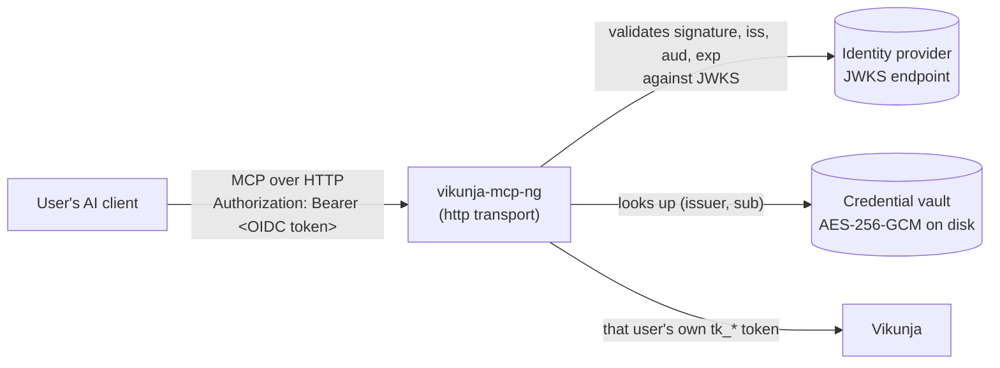

# Installing and configuring OIDC mode

This is the operator's manual for running `vikunja-mcp-ng` as a **hosted, multi-user MCP
server** that authenticates its callers with OIDC access tokens. It covers installation,
every configuration key, identity-provider setup, a verification ladder that tells you
*which* layer is broken when something is, and the operational tasks that follow.

It is deliberately provider-agnostic. Keycloak appears as a worked example because it is
what this feature was validated against, but nothing Keycloak-specific exists in the code —
any standards-compliant OIDC provider works identically. For the specifics of putting **IBM
MCP Context Forge** in front of this server, read this manual first, then
[`CONTEXT-FORGE.md`](CONTEXT-FORGE.md). For *why* the design is shaped this way, including
the threat model, see [`OIDC-RESOURCE-SERVER.md`](OIDC-RESOURCE-SERVER.md).

> **Status: beta.** The authentication boundary, the vault, provisioning, and per-identity
> isolation have all been exercised against a real gateway + Keycloak + Vikunja deployment.
> What has *not* happened yet is sustained production use by anyone other than its authors.
> Treat it accordingly: pilot it, keep backups of the vault, and report what breaks.

---

## 1. The model in one page

Read this section even if you skip everything else. Almost every support question about this
mode comes from one of the two ideas below not landing.

**An OIDC access token authenticates a *person*. It is not a Vikunja credential.**

Vikunja accepts only its own `tk_*` API tokens. There is no token exchange between your
identity provider and Vikunja, and this server does not invent one. So each user links their
own Vikunja token **once**, through the MCP tool surface itself (`vikunja_auth provision`).
The server encrypts that token into a local vault, keyed to the validated identity from the
JWT, and uses it for that user's calls from then on.



**This server is a pure resource server.** It never talks to your identity provider's token
endpoint, never sees a login form, never holds a client secret, and never handles a refresh
token. It fetches public signing keys from the JWKS endpoint and validates whatever bearer
token it is handed. Whoever sits in front — a gateway, your own proxy, a client that already
holds tokens — owns the login flow.

Two consequences worth internalising:

- **The thing in front of this server is the trust anchor.** If it can mint or forge a token
  your provider would sign, it can act as any user. That is by design; it is what
  authenticates people.
- **This server adds no authorization layer above Vikunja's own.** A provisioned user can do
  exactly what their own `tk_*` token permits in Vikunja — no more, no less.

**What this mode cannot do: the JWT-only tools.** Because the vault holds `tk_*` API tokens
(`vikunja_auth provision` rejects a JWT — it would expire within hours and nothing here can
refresh it), every identity in this mode authenticates to Vikunja as an API token. The tools
that require a JWT session — `vikunja_users`, the four export tools,
`vikunja_caldav_tokens`, `vikunja_admin`, `vikunja_user_deletion` — therefore never appear in
`tools/list` here, whatever the module keys say. That is not a bug and not a module you
forgot to enable: Vikunja's `/user/*`, `/admin/*` and CalDAV-token endpoints reject `tk_*`
tokens server-side anyway. Run those from a `stdio` deployment with a JWT session. See
[CONFIGURATION.md § Composing with Auth-Type Gating](CONFIGURATION.md#composing-with-auth-type-gating).

---

## 2. Before you start

You need:

| | Why |
|---|---|
| **Node.js 22+** (or Docker) | The runtime floor; see [installation](#3-install) |
| **A reachable Vikunja instance** | One shared instance for everyone — there is no per-user Vikunja routing |
| **An OIDC provider** with a JWKS endpoint | Only its *public* discovery data is needed |
| **A 32-byte vault master key** | `openssl rand -hex 32` — see [§4](#4-generate-the-vault-master-key) |
| **A persistent volume for the vault file** | Ephemeral storage means every restart unlinks every user |
| **Something in front that performs the login** | A gateway, or clients that already obtain tokens |

And you should have decided:

- **Which audience value** your tokens will carry for this server (e.g. `vikunja-mcp-ng`).
  Most providers do *not* put a useful `aud` in access tokens by default — see [§6](#6-configure-your-identity-provider).
- **Where the vault file lives**, and how it gets backed up.
- **Where the master key lives** — ideally a secret manager, on a different volume from the
  vault file itself.

---

## 3. Install

### Option A — npm (recommended for a first deployment)

```bash
npm install -g vikunja-mcp-ng@beta
```

The binary is `vikunja-mcp-ng`; it reads configuration from the environment (§5) and, in
HTTP mode, opens a listener rather than speaking over stdin/stdout.

### Option B — from source

```bash
git clone https://github.com/netadvanced/vikunja-mcp-ng.git
cd vikunja-mcp-ng
npm ci
npm run build
node dist/index.js
```

### Option C — container

```bash
docker run -d --name vikunja-mcp \
  -p 127.0.0.1:8765:8765 \
  -v /srv/vikunja-mcp:/data \
  --env-file /etc/vikunja-mcp/env \
  ghcr.io/netadvanced/vikunja-mcp-ng:beta
```

With a volume mounted at `/data` as above, point the vault inside it —
`VIKUNJA_MCP_VAULT_PATH=/data/vault.json` in the env file — or the vault lands on the
container's ephemeral filesystem and every restart unlinks every user (§10).

> **Know this before you containerise.** The image was built for stdio use and carries no
> `EXPOSE` and no `HEALTHCHECK` — its Dockerfile still says *"this is a stdio MCP server, not
> a network listener."* Nothing is broken by that (`EXPOSE` is metadata; `-p` works
> regardless), but your orchestrator will not learn the port or liveness probe from the image
> and you must supply both yourself. Point your probe at `GET /healthz` — and read
> [§11](#11-known-limitations) first, because `/readyz` does not mean what its name suggests.

### A systemd unit, for the common case

```ini
[Unit]
Description=vikunja-mcp-ng (OIDC mode)
After=network-online.target

[Service]
Type=simple
User=vikunja-mcp
EnvironmentFile=/etc/vikunja-mcp/env
ExecStart=/usr/bin/node /opt/vikunja-mcp-ng/dist/index.js
Restart=on-failure
# The vault file and its key are the whole security story — see §10.
ReadWritePaths=/var/lib/vikunja-mcp
ProtectSystem=strict
ProtectHome=true
PrivateTmp=true
NoNewPrivileges=true

[Install]
WantedBy=multi-user.target
```

---

## 4. Generate the vault master key

```bash
openssl rand -hex 32        # 64 hex characters
# or
openssl rand -base64 32     # base64, also accepted
```

Either encoding works; the key must decode to **exactly 32 bytes** (AES-256-GCM).

Write it to a file readable only by the service account, and point the server at the *file*
rather than passing the value inline:

```bash
install -m 0600 -o vikunja-mcp -g vikunja-mcp /dev/null /etc/vikunja-mcp/vault.key
openssl rand -hex 32 > /etc/vikunja-mcp/vault.key
```

`VIKUNJA_MCP_VAULT_KEY_FILE=/etc/vikunja-mcp/vault.key` keeps the key out of `docker
inspect`, out of `ps`, and out of your orchestrator's environment dumps. The inline
`VIKUNJA_MCP_VAULT_KEY` exists for convenience and local testing; prefer the `_FILE` form
anywhere real. This is the same `*_FILE` convention the rest of the server's secrets use —
see [`CONFIGURATION.md`](CONFIGURATION.md).

**Losing the key is losing the vault.** There is no recovery path: every user re-provisions.
Losing the key *and* the vault file to an attacker together is equivalent to handing over
every user's Vikunja token in plaintext. Store them apart.

---

## 5. Configure the server

Configuration comes from a JSON config file, environment variables, or both — **environment
always wins**. The vault master key is the exception: it is read only from the environment
and never from the config file.

### 5.1 The rule that catches people first

**HTTP mode refuses to start without complete OIDC *and* vault configuration.** This is
deliberate and not overridable: there is no "HTTP without auth" mode, not even briefly, not
behind a flag. A missing or partial `oidc` block is a hard startup error, not a silent
downgrade to something unauthenticated.

So a valid HTTP deployment always has all of: `transport=http`, `oidc.issuer`,
`oidc.audience`, `oidc.jwksUri`, `vault.path`, and a vault key. If the process exits at
startup complaining about configuration, you are missing one of those six.

The default transport remains `stdio`, byte-for-byte unchanged. Everything in this manual is
inert unless you set `transport=http`.

### 5.2 Complete variable reference

**Transport**

| Env var | Config key | Default | Notes |
|---|---|---|---|
| `VIKUNJA_MCP_TRANSPORT` | `transport` | `stdio` | Set to `http` for this mode |
| `VIKUNJA_MCP_HTTP_HOST` | `http.host` | `127.0.0.1` | Loopback by default, so a misconfiguration fails closed (unreachable) rather than exposed |
| `VIKUNJA_MCP_HTTP_PORT` | `http.port` | `8765` | |
| `VIKUNJA_MCP_HTTP_PATH` | `http.path` | `/mcp` | The path you register upstream |
| `VIKUNJA_MCP_HTTP_ALLOWED_HOSTS` | `http.allowedHosts` | `host:port` | Comma-separated. Feeds the SDK's DNS-rebinding protection, **always on** in HTTP mode — see the trap below |

**OIDC** (consulted only when `transport=http`)

| Env var | Config key | Required | Notes |
|---|---|---|---|
| `VIKUNJA_MCP_OIDC_ISSUER` | `oidc.issuer` | **yes** | Must equal the token's `iss` claim **exactly** — plain string comparison, no prefix or trailing-slash tolerance |
| `VIKUNJA_MCP_OIDC_AUDIENCE` | `oidc.audience` | **yes** | Required `aud` value; comma-separated for several |
| `VIKUNJA_MCP_OIDC_JWKS_URI` | `oidc.jwksUri` | **yes** | Your provider's JWKS endpoint (the `jwks_uri` from its discovery document) |
| `VIKUNJA_MCP_OIDC_ALLOWED_ALGS` | `oidc.allowedAlgs` | no | Comma list; defaults to `RS256`. **`none` is never accepted, whatever you set** |
| `VIKUNJA_MCP_OIDC_CLOCK_SKEW_SEC` | `oidc.clockSkewSec` | no | Seconds, default `60`, applied to `exp`/`nbf`/`iat`. **Note the `_SEC` suffix** — `VIKUNJA_MCP_OIDC_CLOCK_SKEW` is not a variable and is silently ignored |
| `VIKUNJA_MCP_OIDC_REQUIRED_SCOPE` | `oidc.requiredScope` | no | Coarse gate. A valid token missing it gets **403**, not 401 |

**Vault**

| Env var | Config key | Required | Notes |
|---|---|---|---|
| `VIKUNJA_MCP_VAULT_PATH` | `vault.path` | **yes** | Not secret, just a location. Must be on persistent storage |
| `VIKUNJA_MCP_VAULT_KEY` | *(never in config)* | **yes** | 32 bytes, hex or base64 |
| `VIKUNJA_MCP_VAULT_KEY_FILE` | *(never in config)* | alternative | Path to a file containing the key — prefer this |

**Vikunja**

| Env var | Notes |
|---|---|
| `VIKUNJA_URL` | The one shared Vikunja instance, e.g. `https://vikunja.example.com` |
| `VIKUNJA_API_TOKEN` | **Do not set this in HTTP mode.** It is the single-tenant stdio auto-connect credential and has no per-user meaning here. Every user's credential comes from the vault |

### 5.3 A complete worked configuration

`/etc/vikunja-mcp/env`:

```bash
VIKUNJA_MCP_TRANSPORT=http
VIKUNJA_MCP_HTTP_HOST=127.0.0.1
VIKUNJA_MCP_HTTP_PORT=8765
VIKUNJA_MCP_HTTP_PATH=/mcp
VIKUNJA_MCP_HTTP_ALLOWED_HOSTS=vikunja-mcp.internal:8765,127.0.0.1:8765

VIKUNJA_URL=https://vikunja.example.com

VIKUNJA_MCP_OIDC_ISSUER=https://idp.example.com/realms/staff
VIKUNJA_MCP_OIDC_AUDIENCE=vikunja-mcp-ng
VIKUNJA_MCP_OIDC_JWKS_URI=https://idp.example.com/realms/staff/protocol/openid-connect/certs

VIKUNJA_MCP_VAULT_PATH=/var/lib/vikunja-mcp/vault.json
VIKUNJA_MCP_VAULT_KEY_FILE=/etc/vikunja-mcp/vault.key
```

Equivalent config file, for the non-secret half:

```json
{
  "transport": "http",
  "http": { "host": "127.0.0.1", "port": 8765, "path": "/mcp" },
  "oidc": {
    "issuer": "https://idp.example.com/realms/staff",
    "audience": "vikunja-mcp-ng",
    "jwksUri": "https://idp.example.com/realms/staff/protocol/openid-connect/certs"
  },
  "vault": { "path": "/var/lib/vikunja-mcp/vault.json" }
}
```

### 5.4 The `allowedHosts` trap

DNS-rebinding protection is always on in HTTP mode, and it checks the **`Host` header as it
actually arrives**, not the address you bound to. The comparison is an exact string match
on the full `host:port` value — `localhost:8765` and `127.0.0.1:8765` are two different
entries, and neither implies the other. When `allowedHosts` is unset it defaults to
your configured `host:port`, which is right for direct loopback calls and wrong for almost
every real topology.

If a gateway runs in a container and reaches the server on the host, the request arrives with
`Host: host.docker.internal:8765`. If a reverse proxy fronts it, the header is whatever the
proxy sends. Every such value must be listed:

```bash
VIKUNJA_MCP_HTTP_ALLOWED_HOSTS=vikunja-mcp.internal:8765,127.0.0.1:8765,host.docker.internal:8765
```

Symptom when you get this wrong: **HTTP 403** with a JSON-RPC error body saying `Invalid
Host header`, on requests carrying a valid token and correct OIDC settings. Because the
token check runs first, this arrives *after* successful authentication — and a 403 also
being the scope-gate status makes it read exactly like an auth failure. Tell them apart by
the body and headers: the host rejection has the `Invalid Host header` JSON-RPC body and no
`WWW-Authenticate` header; the scope rejection carries
`WWW-Authenticate: Bearer error="insufficient_scope"`.

---

## 6. Configure your identity provider

### 6.1 What this server actually requires

Only three things, from any provider:

1. **A JWKS endpoint** serving the public signing keys.
2. **Access tokens carrying a `sub` claim.** `(issuer, sub)` is the tenancy key — the vault
   record, the rate limit, and the session state all hang off it. A token without `sub` is
   rejected.
3. **An `aud` claim** containing the value you configured as `VIKUNJA_MCP_OIDC_AUDIENCE`.

Signature, issuer, audience, and expiry are checked. `alg: none` and unexpected algorithms
are refused regardless of configuration.

### 6.2 Keycloak, worked

The realm's own defaults are not sufficient — the two most common failures below are both
*silent*, in the sense that the token looks fine until this server refuses it with a generic
error.

**a. Add an audience mapper.** Keycloak's default access-token audience is `["account"]`,
which will never match your configured value. On the client, add a protocol mapper of type
`oidc-audience-mapper` with `included.custom.audience` set to your audience (e.g.
`vikunja-mcp-ng`). Tokens should then carry `aud: ["vikunja-mcp-ng", "account"]`.

**b. Ensure the `basic` client scope is a default scope.** Without it, issued access tokens
have **no `sub` claim at all**, and this server correctly rejects them — with a generic
`invalid_token` that gives no hint that a claim is missing. The `basic` scope is what carries
the `oidc-sub-mapper`.

**c. Give users a first and last name.** Not cosmetic: without them, Keycloak's declarative
user-profile config silently attaches a `VERIFY_PROFILE` required action, and token requests
fail with *"Account is not fully set up"* — an error that points at passwords and grant types
and has nothing to do with either.

**d. Register the redirect URI** your gateway or client will use, on the Keycloak client.

**Verify before moving on.** Decode a real token and confirm both claims with your own eyes:

```bash
curl -s -X POST https://idp.example.com/realms/staff/protocol/openid-connect/token \
  -d 'grant_type=password&client_id=<client>&client_secret=<secret>&username=<user>&password=<pass>' \
  | jq -r .access_token | cut -d. -f2 | base64 -d | jq '{sub, aud, iss, exp}'
```

`sub` present, `aud` including your configured audience, `iss` byte-identical to
`VIKUNJA_MCP_OIDC_ISSUER`. If any of the three is off, fix it here — no amount of server-side
configuration compensates for a token that lacks them.

---

## 7. Start it, and verify layer by layer

Start the server, then walk these four rungs **in order**. Each isolates one layer, so the
first one that fails tells you where the problem is.

One thing before you start typing: rungs 3 and 4 pass through the transport's `Host`
allowlist (§5.4), so curl an address that is **literally listed** in your `allowedHosts` —
the examples use `127.0.0.1:8765`, which the worked configuration in §5.3 includes.
`localhost:8765` is a *different* string and would 403 unless you list it too. Rungs 1 and
2 are answered before that check and don't care.

```bash
# Rung 1 — the process is up. Unauthenticated by design; touches nothing.
curl -s 127.0.0.1:8765/healthz
# → {"status":"ok"}

# Rung 2 — auth is actually enforced. A missing token must be refused.
curl -s -o /dev/null -w '%{http_code}\n' -X POST 127.0.0.1:8765/mcp
# → 401

# Rung 3 — your provider's tokens are accepted. Anything but 401 here means
#           the JWT layer is satisfied; the MCP payload matters less than the code.
TOK=$(curl -s -X POST https://idp.example.com/realms/staff/protocol/openid-connect/token \
  -d 'grant_type=password&client_id=<client>&client_secret=<secret>&username=<user>&password=<pass>' \
  | jq -r .access_token)
curl -s -o /dev/null -w '%{http_code}\n' -X POST 127.0.0.1:8765/mcp \
  -H "Authorization: Bearer $TOK" -H 'Content-Type: application/json' \
  -H 'Accept: application/json, text/event-stream' \
  -d '{"jsonrpc":"2.0","id":1,"method":"tools/list"}'
# → 200

# Rung 4 — the tool surface answers as your identity.
curl -s -X POST 127.0.0.1:8765/mcp \
  -H "Authorization: Bearer $TOK" -H 'Content-Type: application/json' \
  -H 'Accept: application/json, text/event-stream' \
  -d '{"jsonrpc":"2.0","id":2,"method":"tools/call",
       "params":{"name":"vikunja_auth","arguments":{"subcommand":"status"}}}'
# → a result reporting you are not linked yet. That is the correct answer here.
```

Rung 4 reporting "no Vikunja API token linked" is **success**, not failure. It means the
token was validated, the identity was resolved, and the vault was consulted. Provisioning is
the next section.

If rung 2 returns anything other than 401, stop and re-read §5.1 — a server serving
unauthenticated HTTP is not a configuration you should be able to reach.

---

## 8. Put a gateway in front

Whatever fronts this server must perform the user-facing login and forward **the end user's
own access token** as `Authorization: Bearer <token>` on each proxied request.

That last part is the subtlety that costs people the most time. Many gateways offer an OAuth
mode that authenticates the *gateway* to the upstream with its own service credential. Under
such a mode every request arrives as the same identity, every user shares one vault record,
and the entire per-user model collapses — while appearing to work. **Check what your gateway
actually forwards before you trust it.** The distinction to look for: does the upstream
receive the caller's token, or one the gateway minted for itself?

For IBM MCP Context Forge specifically, the working configuration is `authType: bearer` with
`passthroughHeaders: ["Authorization"]`, and callers supply their own token in a separate
`X-Upstream-Authorization` header which the gateway renames on the way through. The full
registration walkthrough, including the feature flags this requires, is in
[`CONTEXT-FORGE.md`](CONTEXT-FORGE.md).

Also give the gateway a health check target of `/healthz`, and expect its registration probe
to be refused with 401 if it probes the MCP path without a token — that refusal is correct
behavior, and some gateways treat it as a failed registration.

---

## 9. User provisioning

Each user links their Vikunja token once. There is no admin-side bulk import: the design
deliberately allows a credential to be stored only for the identity that presents it, so
nobody — including an operator — can provision on someone else's behalf.

1. **Sign in** through whatever flow the gateway presents.
2. **Create a Vikunja API token**: in Vikunja, **Settings → API Tokens**, create one, copy the
   `tk_...` value.
3. **Provision it** by calling the `vikunja_auth` tool:
   ```json
   { "subcommand": "provision", "apiToken": "tk_xxxxxxxxxxxx" }
   ```
   The server verifies the token really works against Vikunja *before* storing it, encrypts
   it with AES-256-GCM into the vault under the validated identity, and replies with a masked
   confirmation. It never echoes the token back. An optional `vikunjaUrl` argument overrides
   the server's configured instance for that record.
4. **Check status** any time with `{ "subcommand": "status" }` — it reports only the caller's
   own link state, never anyone else's.
5. **Unlink** with `{ "subcommand": "deprovision" }`. Idempotent; doing it twice is not an
   error. Token rotation is deprovision-then-provision.

`connect` is refused in this mode — there is no single server-wide token to connect, and
the error points at `provision` instead. `disconnect` is accepted but simply aliases
`deprovision`: it removes the caller's own vault record. Calling `provision` in stdio mode
is likewise refused, with an error that says so.

**If the server runs in read-only mode, provisioning is blocked too.** `provision` and
`deprovision` are writes and are gated with every other write.

---

## 9a. One-click SSO enrollment (auto-provisioning)

> **Status: opt-in** (`VIKUNJA_MCP_ENROLL_ENABLED=true`). Manual provisioning (§9) keeps
> working unchanged and remains the fallback for Vikunja backends without OpenID login.

When the Vikunja backend is configured with the **same IdP** as an OpenID login provider
(Vikunja's native `auth.openid.providers`), the token-pasting step in §9 can be removed
entirely: an unprovisioned user calls `vikunja_auth provision` **with no token** and gets
back a short-lived **enrollment URL**. One click later their own Vikunja API token has been
minted and vaulted for them, and they return to their chat already connected.

### The flow, validated against the Vikunja v2.4.0 source

Facts below were verified against the upstream `go-vikunja/vikunja` tag `v2.4.0`
(`pkg/modules/auth/openid/{openid,providers}.go`, `pkg/routes/routes.go`,
`pkg/models/{api_tokens,api_routes}.go`) and the pinned local 2.4.0 e2e stack:

1. `vikunja_auth provision` (no token, oidc-http mode, enrollment enabled) mints a
   **ticket** — 32 random bytes, stored server-side, bound to the caller's validated
   `(issuer, sub)`, single-use, TTL `enroll.ticketTtlSec` (default 10 min) — and returns
   `https://<mcp-host>/enroll?ticket=...`.
2. `GET /enroll` validates the ticket, discovers the Vikunja OpenID provider from
   Vikunja's unauthenticated `GET /info` (`auth.openid_connect.providers[]` exposes `key`,
   `auth_url` — the IdP's authorization endpoint from OIDC discovery — `client_id` and
   `scope`), and 302-redirects the browser to the IdP authorization endpoint with
   **Vikunja's own `client_id`**, `redirect_uri = https://<mcp-host>/enroll/callback`, and
   `state = <ticket>`. Because the user already holds an IdP SSO session from their
   connector login, this hop is typically zero-interaction.
3. The IdP redirects back to `GET /enroll/callback?code=...&state=...`. The state is
   consumed as the ticket (single-use, CSRF-safe, and the identity is taken **only** from
   the server-side ticket record — never from anything the browser sent).
4. The server forwards the code to Vikunja's native
   `POST /api/v1/auth/openid/{providerKey}/callback` with body
   `{"code": ..., "redirect_url": "https://<mcp-host>/enroll/callback", "scope": ...}`.
   Vikunja performs the token exchange with the IdP itself, using **its own client
   credentials** and — verified in `exchangeOidcTokens` — **exactly the `redirect_url`
   string from that body** as the OAuth `redirect_uri`. On first login Vikunja
   auto-creates the user account keyed by `(issuer, sub)` (`getOrCreateUser`; the `email`
   claim is mandatory). The response is `{"token": "<jwt>"}` — a full user JWT.
5. That JWT is short-lived in the 2.x line (`service.jwtttlshort`, **10 minutes**), which
   is ample: the server immediately calls `GET /routes` (JWT-authenticated) to enumerate
   every permission group/verb, then `PUT /tokens` with
   `{title, permissions: <full map>, expires_at}` — `PUT /tokens` is JWT-only upstream
   (API tokens can never mint API tokens), and OpenID-created users are not restricted
   from it. The returned `tk_*` token is encrypted into the vault under the initiating
   identity, the JWT is discarded, and the browser gets a minimal
   "Connected — return to your chat" page.

Two IdP-side consequences fall out of the verified facts:

- **The authorization code must be minted for Vikunja's own OAuth client** — Vikunja
  verifies the ID token's audience against its configured `client_id`, so a dedicated
  "enroller" client cannot work without token exchange, which this design deliberately
  avoids.
- **`https://<mcp-host>/enroll/callback` must be added to the valid redirect URIs of
  Vikunja's client at the IdP** (in Keycloak: the Vikunja client's "Valid redirect URIs").
  This is the only IdP change enrollment needs.

### Configuration

| Env var | Default | Meaning |
|---|---|---|
| `VIKUNJA_MCP_ENROLL_ENABLED` | `false` | Master switch for the enrollment endpoints + URL issuing. |
| `VIKUNJA_MCP_ENROLL_PROVIDER` | *(auto)* | Vikunja OpenID provider `key` (or `name`) to enroll through. Optional when the backend has exactly one provider. |
| `VIKUNJA_MCP_ENROLL_VIKUNJA_URL` | `VIKUNJA_URL` | Vikunja API base the enrollment flow talks to (`.../api/v1`). |
| `VIKUNJA_MCP_ENROLL_TOKEN_EXPIRY_DAYS` | `365` | Expiry of the auto-minted per-user `tk_*` token. On expiry the user re-runs `provision` and clicks the fresh link. |
| `VIKUNJA_MCP_ENROLL_TICKET_TTL_SEC` | `600` | How long an issued enrollment URL stays clickable. |

`VIKUNJA_MCP_HTTP_PUBLIC_URL` is **required** whenever enrollment is enabled (a hard
config error otherwise): enrollment links and the OAuth `redirect_uri` are built from it
and must be a browser-reachable, IdP-whitelisted public URL — a bind address never is.
A path prefix is preserved: `https://gw.example/vikunja-mcp/mcp` serves enrollment at
`https://gw.example/vikunja-mcp/enroll`.

**Identity pinning (forwarded-link protection).** Before anything is minted or stored,
the callback fetches `GET /user` with the fresh Vikunja JWT and requires that the
signed-in account matches the identity the enrollment link was issued to — `email` claim
first (case-insensitive), `preferred_username` vs. username as the fallback, **failing
closed** when the MCP access token carries neither claim. Without this, an attacker
could request a link, hand it to a victim with an active SSO session, and capture the
victim's Vikunja token under the attacker's identity. Consequence for operators: the
connector's access tokens must include the `email` (or `preferred_username`) claim, and
under the same-IdP precondition these match what Vikunja stores for OpenID users.

**Real matching behavior, per Vikunja version (issue #223).** Design is not the bug here
— email-first with a username fallback is the right approach, and it is exactly what
`verifyEnrolledAccount` implements. The gap is that `GET /user` on Vikunja 2.4.0, the
current floor and tested default, **does not return an `email` field at all** (confirmed
against the live e2e stack). That makes the email-first path dead code in practice on
2.4.0: `enrolled.email` is always `undefined`, so the email comparison can never succeed,
and matching falls through to the `preferred_username` fallback every time. **Treat
matching on 2.4.0 as effectively username-only**, not email-or-username as the code
reads. The email-first check itself is not wrong; it activates automatically, with no
code change, the moment a Vikunja version's `GET /user` starts returning `email` — this
is a version-shaped gap, not a broken branch. Keep the connector issuing
`preferred_username` (ideally both claims) so the fallback has something to match
against today.

We looked at fetching email a different way on 2.4.0 (issue #223 raised this as an
option) and found no viable route: `GET /user` is the only per-session "who am I"
endpoint and it omits email outright, and the global `GET /users?s=` search does not
help either — it is a search-*by* username/name/email endpoint, so using it here would
require already knowing the target's email to search by, which is precisely the piece
`GET /user` fails to supply. There is no endpoint that hands back the current session's
own email when `GET /user` won't. There is nothing to add on 2.4.0 beyond documenting the
gap here; this is intentionally not coded around.

**Verified against a live 2.6.0 server (2026-09-02, during the #254 alignment work):**
email-matching does NOT start working on 2.6.0 either. `GET /user` still omits `email`
there, on both the v1 and v2 API, exactly as on 2.4.0. Vikunja 2.6.0 does add a
`pending_email` field to some user-facing responses, but it is not the same thing as a
confirmed `email`, and it does not appear on `GET /user` under the enrollment JWT. So
matching stays effectively username-only through the current aligned/tested version too
— this is not a 2.4.0-specific gap that 2.6.0 closes.

> **Warning: do not pre-create a local Vikunja account with a username an SSO user will
> later present.** If a local account already holds the username an OIDC login would
> auto-create (`preferred_username`), Vikunja does not fail or merge accounts; it
> silently assigns the new OpenID account a random username instead (for example
> `quickly-touched-buzzard`). Identity pinning then has nothing to match against: the
> enrollment link was issued to `preferred_username`, but the account Vikunja just
> authenticated carries a different, randomly generated username. This mostly comes from
> staging or setup shortcuts, such as hand-creating a local admin or test account before
> SSO is wired up. **The operational rule: never pre-create a local Vikunja account whose
> username collides with a value an IdP user will present as `preferred_username`** — that
> collision is exactly what triggers Vikunja's auto-rename-on-collision behavior. If the
> collision already happened, rename or remove the colliding local account (or have the
> user re-authenticate once it is gone).
>
> **Mitigation shipped for issue #224:** the callback still fails closed on a mismatch —
> that part is deliberately unchanged — but it no longer returns the same generic message
> for every mismatch. Before giving up, it makes one best-effort `GET /users?s=<username>`
> lookup (searching by username never requires the target account to be discoverable,
> unlike a name/email search) for the `preferred_username` the identity presented. If that
> confirms a **different** account already holds it, the 403 names the squatting scenario
> explicitly and points at the fix (rename or remove the colliding account) instead of the
> generic "opened by another account" wording. When the lookup is inconclusive — the
> search itself fails, or turns up no other holder — the original generic message is used,
> because a plain forwarded-link attack looks identical from the server's side and must
> still fail closed. This is a diagnostic improvement, not a bypass: nothing is
> auto-linked or auto-renamed, and Vikunja's random-username *pattern* is never
> pattern-matched (it is undocumented and not guaranteed) — only a live, checkable account
> lookup is used. See the troubleshooting table in [§12](#12-troubleshooting) for the
> symptom-first version.

Two more behaviours worth knowing: an enrollment ticket is only consumed once the code
exchange with Vikunja **succeeds** — a transient upstream failure leaves the link
redeemable — and a token-less `provision` by an **already-linked** identity returns
"already linked" instead of minting a second (orphaned) full-permission token; rotate
deliberately with `deprovision` → `provision`.

**Failure behaviour:** if the Vikunja backend has OpenID disabled, no providers, or the
named provider is missing, `vikunja_auth provision` (without a token) fails with a clear
error pointing at the manual path — and the manual path always keeps working. The
auto-minted token grants the full `GET /routes` permission map (everything an API token
*can* do upstream — `/tokens`, `user_*` and `subscriptions` routes are excluded by Vikunja
itself for all API tokens).

---

## 10. Operations

**Persistence.** The vault file is the only durable state. If it lives on ephemeral storage,
every restart silently unlinks every user, and they will report the `AUTH_REQUIRED` prompt in
unison. That symptom — *many* users unprovisioned at once — nearly always means storage, not
authentication.

**Backup.** Back up the vault file like a credential store, because it is one. It is
encrypted at rest, so a backup is only as safe as the separation between it and the master
key. Restoring is a file copy; the key must be the same one the file was written with.

**Key rotation.** There is no in-place re-encryption today. Rotating the master key means
every user re-provisions: deploy the new key, let the old vault go, have users run `provision`
again. Plan it as a user-visible event rather than a silent maintenance task.

**Upgrades.** Stop, replace, start. The vault format is stable across the beta line; a
release that changes it will say so in `CHANGELOG.md`.

**Rate limits** apply per identity, so one heavy user cannot starve the others. **Circuit
breakers do not** — they are shared per Vikunja endpoint, because they exist to protect the
one shared Vikunja instance. One user hammering a failing endpoint can therefore trip the
breaker for everyone. This is a documented, accepted coupling, not a bug to file per
incident; see [`OIDC-RESOURCE-SERVER.md`](OIDC-RESOURCE-SERVER.md) §4.

---

## 11. Known limitations

Read these before you design around anything.

- **`/readyz` is a stub.** It returns `{"status":"ok"}` unconditionally and checks nothing —
  not the vault, not JWKS reachability. Its `TODO` says as much in the source. Use it for
  liveness if you like, but **do not** treat a 200 from it as evidence that the vault loaded,
  and do not use it to diagnose mass-unprovisioning.
- **The container image is not shaped for HTTP mode** — no `EXPOSE`, no `HEALTHCHECK`. See
  [§3](#option-c--container).
- **Circuit breakers are shared across users.** See [§10](#10-operations).
- **Rate limits are per identity only — there is no aggregate ceiling.** Nothing caps the
  *combined* load all users place on the shared Vikunja instance; the shared circuit
  breakers are the only collective backstop. (The design document mentions an optional
  global ceiling; it was not built.)
- **No master-key rotation without re-provisioning.** There is no in-place re-encryption;
  rotating the key is a user-visible event. See [§10](#10-operations).
- **Single issuer.** One `issuer` value is trusted per deployment. Federating several
  providers means several deployments.
- **No admin view of the vault.** By design there is no tool to list who has provisioned, or
  to provision on another user's behalf.

---

## 12. Troubleshooting

Work down this table by *symptom*. The three failure layers look similar from a client and
have completely different fixes.

| Symptom | Layer | Cause and fix |
|---|---|---|
| `401 invalid_token`, before any tool runs | JWT validation | Wrong `issuer` (must match `iss` exactly), wrong `audience`, wrong JWKS URI, expired token, or a token with no `sub` claim. See §6.2 — the missing-`sub` case is the one that looks inexplicable |
| `403` with `WWW-Authenticate: Bearer error="insufficient_scope"` | Scope gate | Token is valid but lacks `VIKUNJA_MCP_OIDC_REQUIRED_SCOPE` |
| `403` with an `Invalid Host header` JSON-RPC body, despite a token you just verified by hand | Transport | `allowedHosts` does not list the `Host` header as it actually arrives (exact `host:port` string match). See §5.4 |
| `AUTH_REQUIRED` — "haven't linked a Vikunja API token" | Tool level | Expected for a first-time user: run `provision`. If the user insists they already did, check they are signing in as the *same* identity, and check the vault is on persistent storage |
| Enrollment `403`, "signed-in account does not match" for a real, legitimate user | Enrollment / identity pinning | Their `preferred_username` was already taken by an existing local Vikunja account, so Vikunja auto-created their SSO account under a random username instead of the expected one. Rename or remove the colliding local account, then have them re-authenticate. See §9a's warning and issue #224 |
| *Many* users unprovisioned at once | Storage | The vault file was lost — ephemeral volume, or a failed restore. Not an auth problem |
| Server exits at startup complaining about configuration | Config | HTTP mode requires all six of transport, issuer, audience, JWKS URI, vault path, vault key. See §5.1 |
| Every user's calls behave as the same person | Gateway | Your gateway is authenticating with its own service credential instead of forwarding the caller's token. See §8 |
| Errors mentioning an open circuit breaker | Vikunja health | The shared Vikunja instance is unhealthy. This happens *after* auth and vault lookup both succeeded; it resets automatically |
| A tool is missing from the catalog entirely | Gateway | Some gateways filter tool descriptions by content. Check the gateway's skipped-tools list |

When a token is rejected, the specific reason is logged server-side at `warn` and
deliberately **not** returned to the client — that is an anti-enumeration measure, so the
server log is the place to look, not the client's error.

---

## See also

- [`OIDC-RESOURCE-SERVER.md`](OIDC-RESOURCE-SERVER.md) — the design, decision log, and threat model
- [`CONTEXT-FORGE.md`](CONTEXT-FORGE.md) — IBM MCP Context Forge deployment specifics
- [`CONFIGURATION.md`](CONFIGURATION.md) — general config loading, the `*_FILE` secrets convention
- [`LOCAL-TESTING.md`](LOCAL-TESTING.md) — `npm run test:e2e:oidc`, the mock-issuer proof lane
