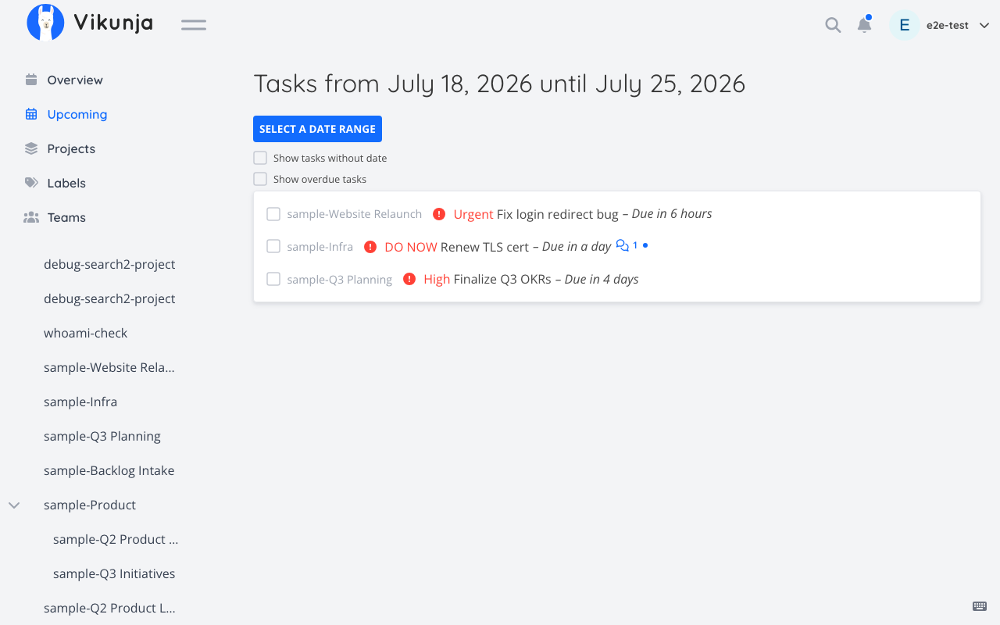
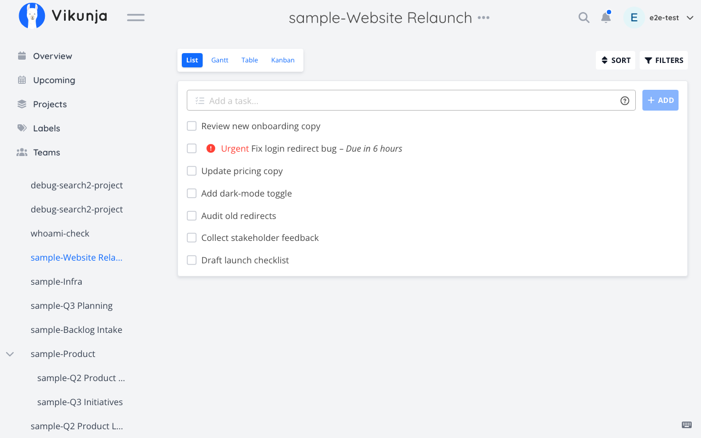

# Sample: Daily triage

Scenario from the [README](../../README.md#daily-triage): a cross-project "what should I work on" sweep, first thing in the morning, without asking the assistant to loop over every project one at a time.

**Setup for this walkthrough:** the connected account has three active projects — "Website Relaunch" (id 12), "Infra" (id 4), "Q3 Planning" (id 9) — with a mix of done and open tasks at various priorities scattered across all three.

---

### 1. Cross-project, priority-ranked list

**User says:**
> "What should I focus on today?"

**Tool call:**
```typescript
vikunja_tasks({
  subcommand: "list",
  allProjects: true,
  filter: "done = false && priority >= 3",
  orderBy: "desc",
})
```
No `projectId` and `allProjects: true` route this to the documented `GET /tasks` endpoint directly — one HTTP call, not one per project. `orderBy: "desc"` (only `'asc' | 'desc'`, the API's own sort-direction control) and `filter` are forwarded straight through to that endpoint; combined with `filter: "done = false && priority >= 3"`, the result is every open, high-priority task across every project the account can see, most-recently-touched-or-highest-ranked first per the server's own ordering — not a client-side re-sort.

**Resulting Vikunja UI state:**
No change — this is a read. The assistant's reply lists tasks from all three projects together, ranked, e.g.: "Fix login redirect bug" (Website Relaunch, priority 4, due today), "Renew TLS cert" (Infra, priority 5, due tomorrow), "Finalize Q3 OKRs" (Q3 Planning, priority 3, due this week). Opening each project's own list view individually and manually cross-referencing priorities would show the same tasks, just without the ranking done for you.




---

### 2. Narrow to one project once you've picked something

**User says:**
> "Okay, just show me what's left in Website Relaunch after that."

**Tool call:**
```typescript
vikunja_tasks({ subcommand: "list", projectId: 12, done: false })
```
Supplying `projectId` switches this to the single-project `GET /projects/{id}/tasks` path instead of the cross-project one — `orderBy`/`filterTimezone`/`filterIncludeNulls`/`expand` (which only apply to the cross-project call) are silently unused here, so they're omitted.

**Resulting Vikunja UI state:**
No change — this is also a read, equivalent to opening the "Website Relaunch" project's list view in the browser with the "hide done tasks" toggle on.




---

## Try it on the local stack

See [docs/LOCAL-TESTING.md](../LOCAL-TESTING.md) to bring up `docker/e2e/docker-compose.yml`, seed a few projects and tasks at different priorities, and get a working API token to try this filter yourself.
