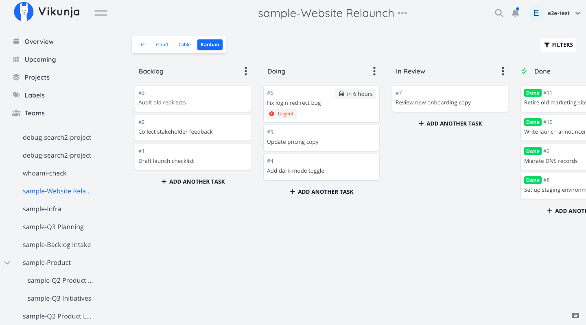
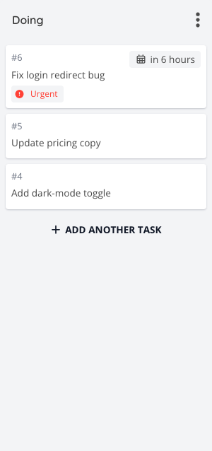
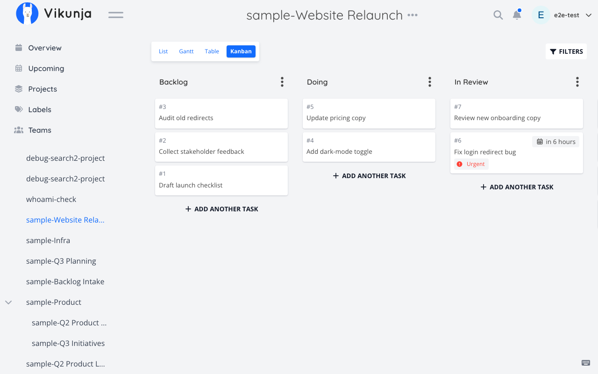
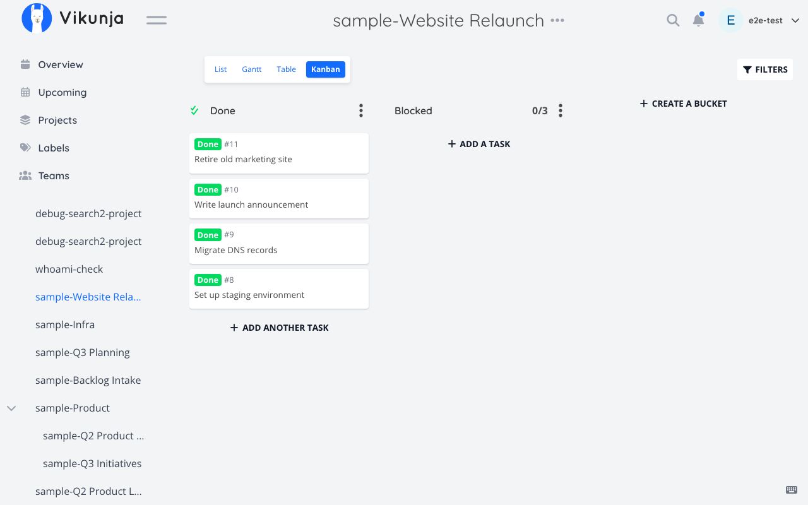
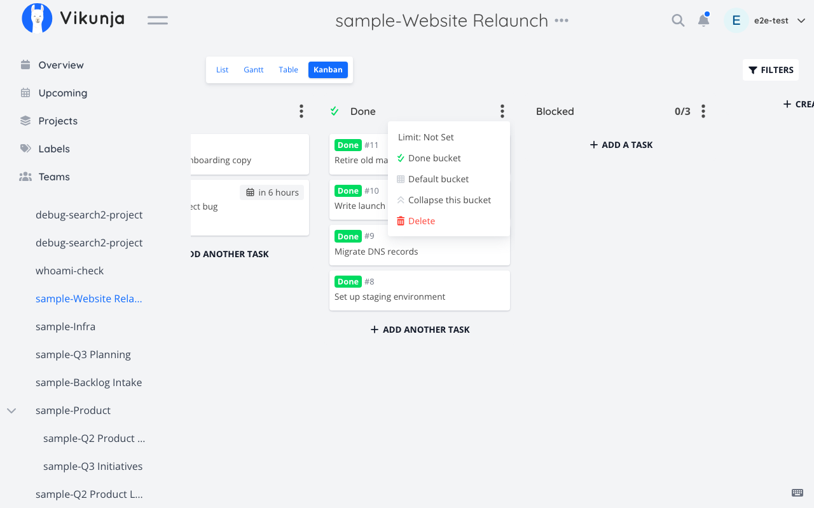

# Sample: Kanban flow

Scenario from the [README](../../README.md#kanban-flow): driving a project's Kanban board — reading its columns, moving a card, adding a column, and marking a "done" column — entirely through conversation.

**Setup for this walkthrough:** project **"Website Relaunch"** (`id: 12`) has a Kanban view (`viewId: 4`) with four buckets: `Backlog` (id 41), `Doing` (id 42), `In Review` (id 43), `Done` (id 46). Task `342`, "Fix login redirect bug", currently sits in `Doing`.

---

### 1. See the board

**User says:**
> "Show me the columns on the Website Relaunch board."

**Tool call:**
```typescript
vikunja_projects({ subcommand: "list-buckets", id: 12 })
```
`viewId` is omitted and auto-resolves to the project's Kanban view.

**Resulting Vikunja UI state:**
The assistant reports four columns in board order — Backlog (6 cards), Doing (3 cards), In Review (1 card), Done (14 cards) — mirroring exactly what's rendered if you opened the project's Kanban view in the browser at `https://your-vikunja-instance.com/projects/12/4`.




---

### 2. See what's in a column

**User says:**
> "What's in Doing right now?"

**Tool call:**
```typescript
vikunja_projects({ subcommand: "list-view-tasks", id: 12, page: 1, perPage: 50 })
```
Returns tasks in real server-side (Kanban card) order for the auto-resolved Kanban view; the assistant filters the response to the `Doing` bucket's tasks in its reply.

**Resulting Vikunja UI state:**
No change — this is a read. In the browser, the `Doing` column shows three cards top to bottom: "Fix login redirect bug" (id 342), "Update pricing copy", "Add dark-mode toggle" — same order the tool returned.




---

### 3. Move a card

**User says:**
> "Move 'Fix login redirect bug' to In Review."

**Tool call:**
```typescript
vikunja_tasks({ subcommand: "set-bucket", id: 342, bucketId: 43 })
```
`projectId` and `viewId` are omitted and auto-resolve from the task itself.

**Resulting Vikunja UI state:**
The card for task 342 disappears from the bottom of `Doing` (now 2 cards) and appears at the bottom of `In Review` (now 2 cards). If a browser tab is open on the board, this happens live via Vikunja's own polling/refresh — the MCP call and the UI both talk to the same `POST /projects/{id}/views/{viewId}/buckets/{bucketId}/tasks` endpoint underneath.



_Captured as the completed post-move state (Playwright can't honestly capture a mid-drag animation frame); caption adjusted from "mid-transition" to describe the resulting state instead._


---

### 4. Add a column

**User says:**
> "Add a 'Blocked' column with a limit of 3 cards."

**Tool call:**
```typescript
vikunja_projects({ subcommand: "create-bucket", id: 12, title: "Blocked", limit: 3 })
```

**Resulting Vikunja UI state:**
A fifth, empty column titled "Blocked" appears at the right edge of the board, with a small "0 / 3" indicator in its header reflecting the WIP limit.




---

### 5. Mark the completion column

**User says:**
> "Make Done the column that auto-completes tasks when they land there."

**Tool call:**
```typescript
vikunja_projects({ subcommand: "set-done-bucket", id: 12, bucketId: 46 })
```
Composite: resolves the view, updates it, and verifies the change took effect — `isDoneBucket` lives on the *view*, not the bucket, so a plain bucket update can't set it.

**Resulting Vikunja UI state:**
The `Done` column header gains a small checkmark badge. Dragging any card into that column in the browser now flips the task's `done` status automatically — same behavior a human would get by setting this in the view's settings panel.




---

## Try it on the local stack

Everything above can be exercised against a real, disposable Vikunja instance — no need to risk a production board. See [docs/LOCAL-TESTING.md](../LOCAL-TESTING.md) to bring up `docker/e2e/docker-compose.yml` and get a working API token in under a minute.
