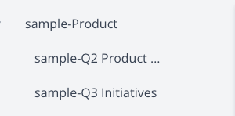
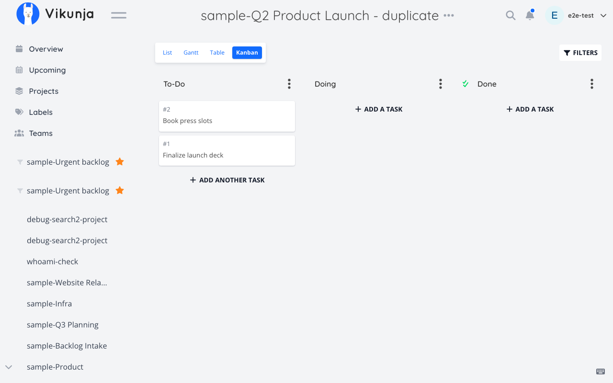

# Sample: Planning

Scenario from the [README](../../README.md#planning): standing up a new quarter's project structure from an existing one, and understanding the resulting hierarchy, without manually recreating dozens of tasks and columns.

**Setup for this walkthrough:** "Q2 Product Launch" (`id: 8`) is a fully-built-out project with tasks, labels, comments, attachments, task relations, and a Kanban layout under parent project "Product" (`id: 5`).

---

### 1. Build the new project hierarchically

**User says:**
> "Create a new 'Q3 Initiatives' project under Product."

**Tool call:**
```typescript
vikunja_projects({ subcommand: "create", title: "Q3 Initiatives", parentProjectId: 5 })
```
Plain CRUD create — hierarchy depth is validated server-side up to 10 levels; a `parentProjectId` that would exceed that, or doesn't exist, is rejected with a clear error rather than silently creating an orphan.

**Resulting Vikunja UI state:**
"Q3 Initiatives" appears in the sidebar nested one level under "Product", next to "Q2 Product Launch".




---

### 2. Check the hierarchy landed where expected

**User says:**
> "Show me the full Product project tree."

**Tool call:**
```typescript
vikunja_projects({ subcommand: "get-tree", id: 5 })
```
Read composite: walks the hierarchy from `id: 5` down (default full depth, or capped with `maxDepth`) and returns it as a nested tree in one call, instead of you having to call `get-children` repeatedly and stitch the levels together yourself.

**Resulting Vikunja UI state:**
No change — this is a read. The reply mirrors exactly what the sidebar shows: "Product" → ["Q2 Product Launch", "Q3 Initiatives", ...any other existing children].


---

### 3. Duplicate last quarter's project as a starting point

**User says:**
> "Duplicate last quarter's launch project as the starting point for Q3."

**Tool call:**
```typescript
vikunja_projects({ subcommand: "duplicate", id: 8, parentProjectId: 5, duplicateShares: true })
```
`PUT /projects/{id}/duplicate` under the hood. Tasks, files, Kanban data, assignees, comments, attachments, labels, relations, and backgrounds all come with the copy. `duplicateShares` defaults to `false` (Vikunja's own default) — copying access grants silently would be a security-relevant surprise, so it's opt-in; here it's set explicitly because the new project should have the same collaborators as the old one.

**Resulting Vikunja UI state:**
A new project appears under "Product" (named by Vikunja's own duplicate-naming convention, based on the source title), fully populated: same Kanban columns with the same cards, same labels attached to the same relative tasks, same comment threads, same collaborators as "Q2 Product Launch" had.




---

### 4. Break a big initiative into subtasks

**User says:**
> "Break 'Launch marketing site' (task 210) into subtasks: 'Write copy', 'Design hero section', and 'Set up analytics'."

**Tool call:**
```typescript
vikunja_tasks({ subcommand: "create-subtask", parentTaskId: 210, title: "Write copy" })
vikunja_tasks({ subcommand: "create-subtask", parentTaskId: 210, title: "Design hero section" })
vikunja_tasks({ subcommand: "create-subtask", parentTaskId: 210, title: "Set up analytics" })
```
Each call is a composite: it resolves task 210's project (so the new task lands in the same project without you having to pass `projectId`), creates the task, relates it to the parent with Vikunja's `subtask` relation kind, then re-reads the parent to verify the relation actually landed — no numeric relation-kind bookkeeping required from you. Best-effort by default (a failure after the task was created is reported honestly rather than silently rolled back); pass `atomic: true` to have a failed relate/verify step delete the just-created task instead.

**Resulting Vikunja UI state:**
Task 210 now shows three subtasks nested under it in the task detail view.

`[SCREENSHOT: Vikunja task detail for "Launch marketing site" showing "Write copy", "Design hero section", and "Set up analytics" listed under Subtasks]`

**Follow-up — check what's there:**
```typescript
vikunja_tasks({ subcommand: "list-subtasks", id: 210 })
```
Read composite: one call summarizes all of task 210's subtasks (id, title, done, assignees) from its relation map, instead of you fetching the task and picking `related_tasks.subtask` apart yourself.

---

## Try it on the local stack

See [docs/LOCAL-TESTING.md](../LOCAL-TESTING.md) to bring up `docker/e2e/docker-compose.yml`, build out a small project with a few tasks and a Kanban board, and try duplicating it yourself.
