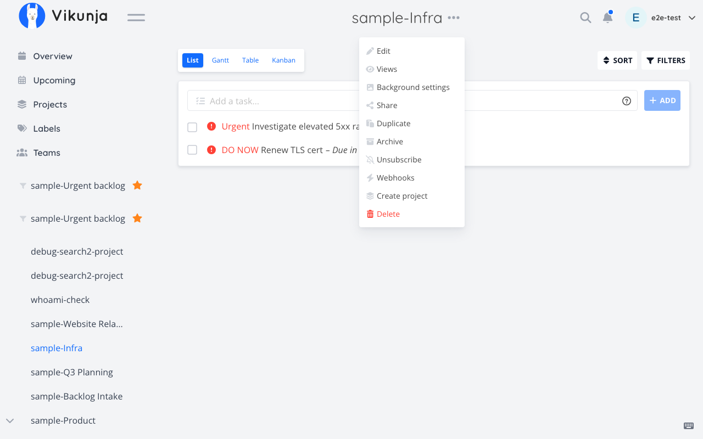
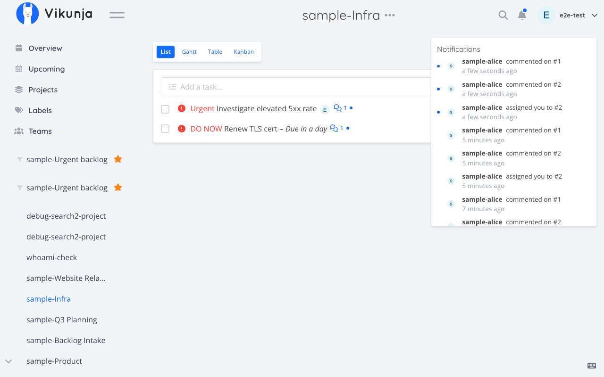
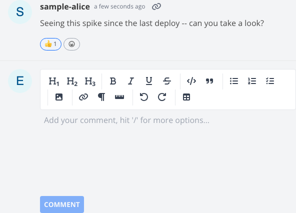

# Sample: Stay informed

Scenario from the [README](../../README.md#stay-informed): keeping up with a project you don't work in every day — subscribing to it, catching up on what changed, and reacting to a comment — as one conversation instead of hopping between three separate tools yourself.

**Setup for this walkthrough:** project "Infra" (`id: 4`) is not one the user actively works in, but they want to keep an eye on it. Task `501` in Infra has a comment (`id: 88`) worth a quick emoji acknowledgement instead of a full reply.

---

### 1. Subscribe to a project

**User says:**
> "Subscribe me to the Infra project."

**Tool call:**
```typescript
vikunja_subscriptions({ subcommand: "subscribe", entity: "project", entityId: 4 })
```
`entity` is `'project'` or `'task'` — subscriptions exist at either level via the same tool.

**Resulting Vikunja UI state:**
The bell/subscribe icon on the "Infra" project page switches from outline to filled, matching what clicking "Subscribe" in the browser does.



_The doc placeholder describes a "subscribe bell icon" in the project header; this UI version has no such icon -- captured the project's "..." menu (Subscribe/Unsubscribe toggle) as the nearest honest evidence of subscription state instead._


---

### 2. Catch up on unread notifications

**User says:**
> "Tell me if I'm missing anything."

**Tool call:**
```typescript
vikunja_notifications({ subcommand: "list", unreadOnly: true })
```
`unreadOnly` is filtered client-side (the API itself has no server-side unread filter) after fetching the current page of notifications.

**Resulting Vikunja UI state:**
No change — this is a read. The assistant's reply summarizes what the notification bell in the top bar would show if opened: e.g. "3 unread: task 501 assigned to you, a comment on task 501, project Infra archived-then-restored."




---

### 3. Mark one read after reviewing it

**User says:**
> "Okay, I've seen the assignment one — mark it read."

**Tool call:**
```typescript
vikunja_notifications({ subcommand: "mark-read", notificationId: 1042 })
```
Idempotent: the underlying endpoint is a pure toggle server-side (no request body to pick read vs. unread), so this tool checks the result and toggles again if needed — calling it twice in a row still leaves the notification read, it won't flip back to unread.

**Resulting Vikunja UI state:**
That notification loses its bold/unread styling in the dropdown; the unread badge count on the bell icon decrements by one.


---

### 4. React instead of replying

**User says:**
> "Give a thumbs up on that comment on task 501 — no need to reply."

**Tool call:**
```typescript
vikunja_reactions({ subcommand: "add", kind: "comments", entityId: 88, value: "👍" })
```
`kind` is `'tasks'` or `'comments'` — `entityId` is the comment's own id (`88`) here, not the task id, since the reaction target is the comment.

**Resulting Vikunja UI state:**
A 👍 reaction chip with a count of 1 appears under that comment in the task's activity feed, the same as clicking the reaction picker in the browser.




---

## Try it on the local stack

See [docs/LOCAL-TESTING.md](../LOCAL-TESTING.md) to bring up `docker/e2e/docker-compose.yml`, subscribe to a project, generate a notification (e.g. by assigning yourself a task), and try marking it read and reacting to a comment yourself.
